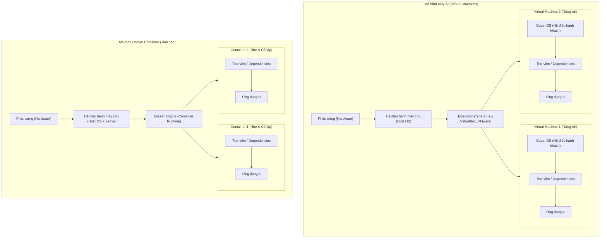
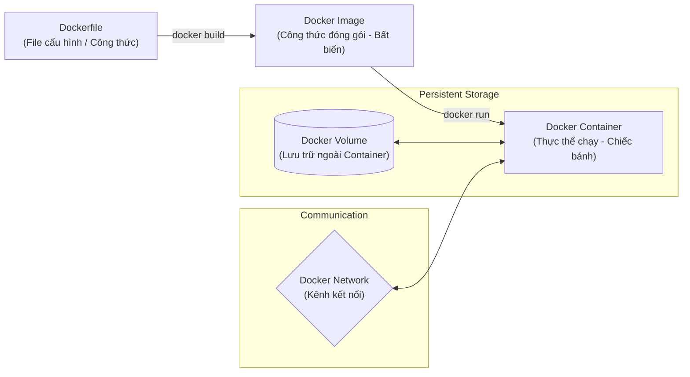
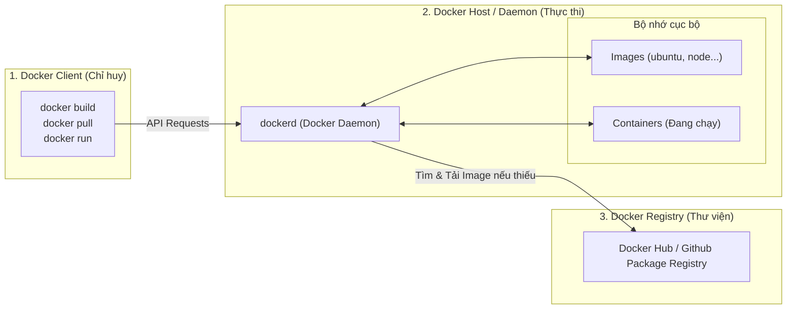
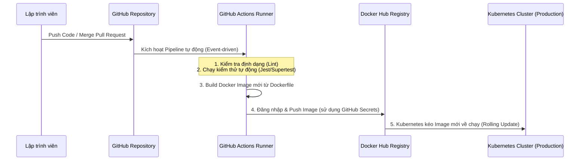

# 🐳 Docker: Từ Hộp Cơm Trưa Ma Thuật Đến Tiêu Chuẩn DevOps

Tài liệu này hệ thống hóa toàn bộ kiến thức về **Docker** từ khóa học **"DevOps from Zero to Hero: Build and Deploy a Production API"**, đồng thời mở rộng các khái niệm chuyên sâu dưới góc nhìn thực chiến để giúp bạn dễ dàng làm chủ công nghệ này.

---

## 📌 Mục Lục (Table of Contents)

1. [1. Ẩn Dụ: Hộp Cơm Trưa Ma Thuật (Lunchbox Metaphor)](#1-ẩn-dụ-hộp-cơm-trưa-ma-thuật-lunchbox-metaphor)
2. [2. Đặc Tính và Lợi Ích Cốt Lõi của Docker](#2-đặc-tính-và-lợi-ích-cốt-lõi-của-docker)
3. [3. So Sánh Chi Tiết: Docker Container vs. Virtual Machine (VM)](#3-so-sánh-chi-tiết-docker-container-vs-virtual-machine-vm)
    * [Sơ đồ Kiến trúc Hệ thống](#sơ-đồ-kiến-trúc-hệ-thống)
    * [Bảng so sánh kỹ thuật chi tiết](#bảng-so-sánh-kỹ-thuật-chi-tiết)
4. [4. Các Khái Niệm Cấu Thành Bên Trong Docker](#4-các-khái-niệm-cấu-thành-bên-trong-docker)
5. [5. Các Thực Hành Nâng Cao & Công Cụ Bổ Trợ (Best Practices)](#5-các-thực-hành-nâng-cao--công-cụ-bổ-trợ-best-practices)
    * [5.1. Cơ chế lưu bộ nhớ đệm (Dependency Caching Layer)](#51-cơ-chế-lưu-bộ-nhớ-đệm-dependency-caching-layer)
    * [5.2. Bảo mật phi Root (Non-root User)](#52-bảo-mật-phi-root-non-root-user)
    * [5.3. Đóng gói đa giai đoạn (Multi-stage Build)](#53-đóng-gói-đa-giai-đoạn-multi-stage-build)
    * [5.4. Docker Compose & Docker Init](#54-docker-compose--docker-init)
    * [5.5. Neon Local (Môi trường DB cục bộ tạm thời)](#55-neon-local-môi-trường-db-cục-bộ-tạm-thời)
6. [6. Kiến Trúc 3 Thành Phần Cốt Lõi (Docker Architecture)](#6-kiến-trúc-3-thành-phần-cốt-lõi-docker-architecture)
    * [6.1. Chi tiết các thành phần:](#61-chi-tiết-các-thành-phần)
    * [Mở rộng: "Daemon" là gì?](#mở-rộng-daemon-là-gì-có-giống-daemon-tools-hồi-xưa-hay-dùng)
    * [Luồng hoạt động phối hợp:](#luồng-hoạt-động-phối-hợp)
7. [7. Ba Quy Trình Làm Việc (Workflows) Với Docker](#7-ba-quy-trình-làm-việc-workflows-với-docker)
    * [7.1. Quy trình làm việc thủ công (Manual Workflow)](#71-quy-trình-làm-việc-thủ-công-manual-workflow)
    * [7.2. Quy trình tự động hóa cục bộ (Docker Compose & Neon Local)](#72-quy-trình-tự-động-hóa-cục-bộ-docker-compose--neon-local)
    * [7.3. Quy trình tự động hóa hoàn toàn trong CI/CD (GitHub Actions)](#73-quy-trình-tự-động-hóa-hoàn-toàn-trong-cicd-github-actions)
8. [8. Kiến Thức Mở Rộng: Docker Hoạt Động Dưới Hạ Tầng Như Thế Nào?](#8-kiến-thức-mở-rộng-docker-hoạt-động-dưới-hạ-tầng-như-thế-nào)
    * [8.1. Namespaces và cgroups (Control Groups)](#81-namespaces-và-cgroups-control-groups)
    * [8.2. Cơ chế lưu trữ Layered File System (UnionFS)](#82-cơ-chế-lưu-trữ-layered-file-system-unionfs)

---

## 🍱 1. Ẩn Dụ: Hộp Cơm Trưa Ma Thuật (Lunchbox Metaphor)

Hãy tưởng tượng bạn chuẩn bị một hộp cơm trưa mang đi làm. 
*   Nếu bạn chỉ mang **món ăn chính** (mã nguồn ứng dụng - Code), khi đến công ty bạn có thể thiếu thìa, thiếu bát, nước sốt không đúng vị, hoặc lò vi sóng ở công ty không tương thích để hâm nóng. Kết quả: Món ăn không ngon hoặc không thể ăn được.
*   **Docker** giải quyết vấn đề này bằng cách cung cấp một **"Hộp Cơm Trưa Ma Thuật"**. Hộp cơm này đóng gói sẵn:
    *   Món ăn chính (Mã nguồn của bạn).
    *   Toàn bộ gia vị, nước sốt, đũa, thìa (Thư viện `node_modules`, các dependencies).
    *   Một chiếc bếp mini tích hợp sẵn có nhiệt độ chuẩn xác (Môi trường chạy runtime như Node.js phiên bản cụ thể, hệ điều hành cơ sở OS tinh giản).

Nhờ hộp cơm ma thuật này, dù bạn ăn ở văn phòng, ở công viên hay mang sang nước ngoài (máy phát triển của dev, máy test, hay máy chủ Production trên Cloud), món ăn của bạn vẫn được chuẩn bị và thưởng thức một cách **hoàn hảo và nhất quán**.

---

## 🚀 2. Đặc Tính và Lợi Ích Cốt Lõi của Docker

| Đặc tính | Ý nghĩa thực tế | Lợi ích DevOps |
| :--- | :--- | :--- |
| **Tính nhất quán** *(Consistency)* | Chạy giống hệt nhau trên mọi môi trường (Dev, Staging, Production). | Xóa bỏ câu nói kinh điển: *"Chạy được trên máy tôi nhưng lỗi trên server!"* |
| **Tính cô lập** *(Isolation)* | Các container hoạt động trong ranh giới riêng, không can thiệp lẫn nhau. | Chạy được nhiều ứng dụng với phiên bản Node.js/Python khác nhau trên cùng một máy chủ mà không sợ xung đột. Tăng độ bảo mật. |
| **Tính di động** *(Portability)* | Đóng gói thành Docker Image là có thể chạy ở bất kỳ đâu có Docker Engine. | Dễ dàng chuyển dịch ứng dụng từ máy cá nhân lên AWS, GCP, Azure hoặc Kubernetes. |
| **Nhẹ & Hiệu quả** *(Lightweight)* | Chia sẻ chung Kernel của hệ điều hành máy chủ (Host OS). Khởi động trong mili-giây. | Tiết kiệm tài nguyên phần cứng, mật độ container trên mỗi server cao hơn nhiều so với VM. |
| **Quản lý phiên bản** *(Version Control)* | Image được tag theo phiên bản (ví dụ: `v1.0.0`, `v1.0.1`, `latest`). | Dễ dàng rollback về phiên bản cũ ngay lập tức nếu phiên bản mới phát sinh lỗi nghiêm trọng. |
| **Khả năng mở rộng** *(Scalability)* | Nhân bản (Replicate) container chỉ bằng một câu lệnh. | Đáp ứng nhanh chóng lưu lượng truy cập tăng đột biến bằng cách scale-out. |
| **Tích hợp DevOps** *(DevOps Integration)* | Hợp nhất cách đóng gói và phân phối phần mềm. | Tạo luồng tự động hóa CI/CD mượt mà từ lúc commit code đến khi deploy. |

---

## 🎨 3. So Sánh Chi Tiết: Docker Container vs. Virtual Machine (VM)

Để hiểu tại sao Docker lại nhẹ và hiệu quả hơn Máy ảo (Virtual Machines), hãy cùng xem sơ đồ so sánh kiến trúc dưới đây:

### 📐 Sơ đồ Kiến trúc Hệ thống



### 📊 Bảng so sánh kỹ thuật chi tiết

| Tiêu chí | Máy ảo (Virtual Machines) | Docker Container |
| :--- | :--- | :--- |
| **Hệ điều hành (OS)** | Mỗi VM chứa một hệ điều hành đầy đủ (**Guest OS**). | Chia sẻ chung **Kernel** của hệ điều hành máy chủ (**Host OS**). |
| **Kích thước** | Rất lớn (từ vài **GB** đến hàng chục GB). | Rất nhẹ (từ vài **MB** đến vài trăm MB). |
| **Tốc độ khởi động** | Chậm (từ vài chục giây đến vài **phút**). | Cực nhanh (tính bằng **giây** hoặc **mili-giây**). |
| **Tiêu hao tài nguyên** | Cao. Phải cấp phát cứng CPU, RAM cho mỗi VM ngay cả khi không dùng hết. | Thấp. Chỉ sử dụng đúng lượng tài nguyên mà ứng dụng thực tế cần. |
| **Mức độ cô lập** | **Cô lập hoàn toàn** ở cấp độ phần cứng (Hypervisor). An toàn bảo mật cực cao. | **Cô lập ở cấp độ tiến trình** (Process-level). Sử dụng cơ chế Namespace/cgroups của Linux. |
| **Hiệu năng (Performance)** | Có suy hao hiệu năng do phải chạy qua lớp Hypervisor và Guest OS. | Gần như tương đương trực tiếp (Native performance) trên máy chủ vật lý. |

---

## 🧱 4. Các Khái Niệm Cấu Thành Bên Trong Docker

Mối quan hệ giữa các thành phần cốt lõi của Docker được mô tả qua vòng đời dưới đây:



*   **Dockerfile:** File văn bản chứa một chuỗi các chỉ dẫn (commands) để Docker build thành một Image.
*   **Docker Image (Recipe - Công thức):** 
    *   Là một gói file tĩnh (tệp chỉ đọc - read-only) chứa toàn bộ những gì cần thiết để chạy ứng dụng.
    *   Được xây dựng theo cơ chế **Layered File System** (mỗi dòng lệnh trong Dockerfile tạo ra một Layer). Các Layer này được xếp chồng lên nhau và có tính chất **bất biến (immutable)**.
*   **Docker Container (Cake - Chiếc bánh):**
    *   Là một tiến trình (process) độc lập chạy trên máy chủ được tạo ra từ Docker Image.
    *   Khi Container được chạy, Docker sẽ tạo thêm một lớp ghi/đọc tạm thời (**Writable Container Layer**) ở trên cùng của Image. Mọi thay đổi dữ liệu (tạo file mới, ghi log) sẽ nằm ở lớp này và sẽ biến mất khi container bị xóa.
*   **Docker Volumes (Bộ nhớ bền vững):**
    *   Vì container có tính chất tạm thời (ephemeral), dữ liệu bên trong container sẽ bị xóa sạch nếu container bị hủy.
    *   **Volume** là cơ chế gắn (mount) một thư mục từ máy chủ vật lý vào bên trong container. Dữ liệu ghi vào thư mục này sẽ được lưu trữ bền vững trên ổ cứng máy chủ, không bị mất đi khi container tắt/xóa và có thể chia sẻ giữa nhiều container.
*   **Docker Network (Kênh giao tiếp):**
    *   Giúp kết nối các container với nhau hoặc với thế giới bên ngoài.
    *   Ví dụ: Container chứa NodeJS API muốn kết nối tới Container chứa Database Postgres thì cả hai cần phải nằm chung một Docker Network.

---

## 🛠️ 5. Các Thực Hành Nâng Cao & Công Cụ Bổ Trợ (Best Practices)

### ⚡ 5.1. Cơ chế lưu bộ nhớ đệm (Dependency Caching Layer)
Trong một dự án Node.js, thư mục `node_modules` thường rất nặng và ít khi thay đổi so với mã nguồn (source code). Nếu viết Dockerfile như thế này:
```dockerfile
# ❌ THỰC HÀNH XẤU (Không tối ưu)
COPY . .
RUN npm install
```
👉 Mỗi khi bạn sửa 1 dòng code, Docker sẽ mất bộ nhớ đệm (cache) từ bước `COPY . .`, buộc nó phải chạy lại `npm install` rất mất thời gian.

**✅ Giải pháp tối ưu:**
```dockerfile
# COPY các file quản lý dependency trước
COPY package*.json ./
# Cài đặt dependency (sẽ được cache lại nếu package.json không đổi)
RUN npm install
# Sau đó mới COPY toàn bộ mã nguồn còn lại
COPY . .
```

### 🔒 5.2. Bảo mật phi Root (Non-root User)
Mặc định, Docker chạy các tiến trình bên trong container với quyền `root`. Nếu hacker khai thác được lỗ hổng bảo mật trong ứng dụng Node.js của bạn, chúng có thể thoát khỏi container (container breakout) và chiếm toàn quyền kiểm soát máy chủ vật lý.

**✅ Giải pháp tối ưu:**
```dockerfile
# Tạo một user hệ thống mới và phân quyền hạn chế
RUN useradd -m appuser
USER appuser
# Khởi chạy ứng dụng bằng user này
CMD ["node", "src/index.js"]
```

### 📦 5.3. Đóng gói đa giai đoạn (Multi-stage Build)
Khi xây dựng các ứng dụng React, NestJS, TypeScript, v.v., chúng ta cần rất nhiều công cụ cồng kềnh (devDependencies, compilers) để build ứng dụng. Nhưng khi chạy trên production, ta chỉ cần file JS đã build xong và runtime gọn nhẹ.

Multi-stage build cho phép chia Dockerfile làm nhiều giai đoạn:
```dockerfile
# Giai đoạn 1: Build ứng dụng (sử dụng image đầy đủ công cụ)
FROM node:20 AS builder
WORKDIR /app
COPY package*.json ./
RUN npm install
COPY . .
RUN npm run build

# Giai đoạn 2: Chạy ứng dụng trên production (chỉ lấy file thành phẩm)
FROM node:20-alpine AS runner
WORKDIR /app
COPY package*.json ./
RUN npm install --only=production
# Copy file build từ Giai đoạn 1 sang
COPY --from=builder /app/dist ./dist
USER node
CMD ["node", "dist/main.js"]
```
> [!TIP]
> Sử dụng Multi-stage build giúp giảm kích thước Docker Image từ **1GB+** xuống còn khoảng **100MB**, giúp tiết kiệm băng thông và tăng tốc độ deploy đáng kể.

### 🎼 5.4. Docker Compose & Docker Init
*   **Docker Init:** Chỉ cần gõ lệnh `docker init` trong thư mục dự án, Docker sẽ tự động quét ngôn ngữ lập trình và sinh ra các file cấu hình chuẩn chỉnh (`Dockerfile`, `.dockerignore`, `compose.yaml`) tối ưu nhất cho bạn.
*   **Docker Compose (`compose.yaml`):** Thay vì gõ những dòng lệnh khởi chạy container dài ngoằng với nhiều cấu hình cổng, mạng, volume phức tạp:
    ```bash
    docker run -d --name db -p 5432:5432 -e POSTGRES_PASSWORD=mysecretpostgres postgres
    ```
    Bạn định nghĩa chúng trong file `compose.yaml` và chỉ cần chạy:
    ```bash
    docker compose up -d
    ```
    Để tắt toàn bộ dịch vụ:
    ```bash
    docker compose down
    ```

### 🧪 5.5. Neon Local (Môi trường DB cục bộ tạm thời)
*   **Neon** là dịch vụ Serverless Postgres nổi tiếng trên Cloud. Tuy nhiên, khi phát triển hoặc chạy kiểm thử (Unit test/Integration test) trong CI/CD pipeline, việc kết nối tới DB thật trên Cloud sẽ gây chậm, tốn chi phí và có nguy cơ làm hỏng dữ liệu thật.
*   **Neon Local** là phiên bản giả lập Neon DB chạy bằng Docker Compose cục bộ. Lập trình viên có thể thoải mái chạy migration, test các câu lệnh SQL với tốc độ cực nhanh mà hoàn toàn cô lập, an toàn.

---

## 🏗️ 6. Kiến Trúc 3 Thành Phần Cốt Lõi (Docker Architecture)

Docker sử dụng kiến trúc **Client-Server**. Các thành phần chính bao gồm:



### 6.1. Chi tiết các thành phần:
*   **Docker Client (Trung tâm chỉ huy):** Là công cụ dòng lệnh (CLI - `docker` CLI) hoặc giao diện đồ họa (Docker Desktop) mà bạn trực tiếp gõ lệnh. Nó không trực tiếp build hay chạy container, mà chỉ đóng vai trò gửi yêu cầu (qua REST API) tới Docker Daemon.
    *   *Hình ảnh ẩn dụ:* Giống như một **đầu bếp trưởng** đưa ra các yêu cầu thực đơn.
*   **Docker Host / Docker Daemon (Trực tiếp thực thi):** Là trái tim của Docker, chạy dưới nền hệ điều hành máy chủ. Nó trực tiếp quản lý các đối tượng như Images, Containers, Networks, và Volumes.
    *   *Hình ảnh ẩn dụ:* Giống như **bếp trưởng quản lý** trực tiếp điều phối nguyên liệu và nướng bánh trong bếp.
*   **Docker Registry / Docker Hub (Thư viện công thức):** Là kho lưu trữ tập trung để chia sẻ và quản lý các Docker Image. Bạn có thể kéo (`pull`) các image có sẵn về máy hoặc đẩy (`push`) image của mình lên.
    *   *Hình ảnh ẩn dụ:* Giống như **thư viện sách dạy nấu ăn khổng lồ** chứa hàng triệu công thức từ khắp nơi trên thế giới.

### ❓ Mở rộng: "Daemon" là gì? Có giống "DAEMON Tools" hồi xưa hay dùng?
> [!NOTE]
> **Giải mã thuật ngữ "Daemon":**
> *   **Daemon** (phát âm là *"de-mon"* hay *"day-mon"*) trong hệ điều hành Unix/Linux là **một chương trình chạy ngầm (background process)** mà không cần sự tương tác trực tiếp của người dùng qua giao diện đồ họa. Nó thường kết thúc bằng chữ **d** (ví dụ: `dockerd` cho Docker Daemon, `sshd` cho SSH Daemon, `systemd`...).
> *   **Sự liên hệ với "DAEMON Tools" (phần mềm mount ổ đĩa ảo chơi game crack):** 
>     *   Nếu bạn từng cài game crack ngày xưa, bạn chắc chắn đã dùng phần mềm **DAEMON Tools** để mount các file `.iso`, `.bin` làm ổ đĩa ảo.
>     *   Thực tế, chữ **DAEMON** trong DAEMON Tools là viết tắt của **"Disk And Execution MONitor"**. Tuy nhiên, phần mềm này cũng hoạt động dưới dạng một dịch vụ chạy ngầm để giả lập phần cứng ổ đĩa ảo ngay trong Windows.
>     *   Cả hai đều chia sẻ chung ý tưởng cốt lõi: Một "linh hồn" vô hình hoạt động âm thầm ở nền hệ thống để thực hiện các tác vụ nặng nhọc thay cho người dùng (lấy cảm hứng từ con quỷ Maxwell - *Maxwell's demon* trong vật lý học, luôn làm việc miệt mài ở hậu trường). Trong Docker, tiến trình này có tên là **`dockerd`**.

### 🔄 Luồng hoạt động phối hợp:
Khi bạn gõ lệnh `docker run ubuntu`:
1.  **Docker Client** tiếp nhận lệnh, dịch thành một API request gửi tới **Docker Daemon (`dockerd`)**.
2.  **Docker Daemon** kiểm tra xem image `ubuntu` đã được tải về máy chủ (Host) chưa.
3.  Nếu chưa có, Daemon sẽ liên hệ với **Docker Registry (Docker Hub)** để tải (`pull`) image đó về máy.
4.  Sau khi tải xong, Daemon "nướng bánh" – khởi tạo và chạy container `ubuntu` cô lập trên máy chủ.

---

## 📋 7. Ba Quy Trình Làm Việc (Workflows) Với Docker

Trong thực tế phát triển phần mềm, quy trình làm việc với Docker được nâng cấp dần từ thủ công lên tự động hóa hoàn toàn:

### 7.1. Quy trình làm việc thủ công (Manual Workflow)
Đây là bước khởi đầu để bạn làm quen với Docker:
1.  **Viết Dockerfile:** Định nghĩa công thức dựng môi trường (`FROM node:20-alpine`, `WORKDIR /app`, `COPY`, `RUN`, `CMD`).
2.  **Tối ưu hóa bộ nhớ đệm (Caching):** Đưa bước copy `package*.json` và `npm install` lên trước để tránh việc cài đặt lại thư viện khi code thay đổi.
3.  **Bảo mật phi Root:** Cấu hình chuyển sang user hạn chế quyền (`USER node` hoặc tạo `appuser`) trước khi chạy ứng dụng.
4.  **Port Mapping & Mount Volume (Hot-Reload khi Dev):** Khởi chạy container thủ công bằng lệnh:
    ```bash
    docker run -d -p 5173:5173 -v $(pwd):/app -v /app/node_modules --name my-app my-app-image
    ```
    *(Gắn thư mục code hiện tại vào container để thay đổi code trên máy host lập tức cập nhật vào container, đồng thời bỏ qua node_modules để tránh xung đột).*
5.  **Quản lý vòng đời:** Dùng `docker ps`, `docker stop`, `docker rm` để dọn dẹp.
6.  **Tag và Push:** Đăng nhập Docker Hub (`docker login`), gắn tag (`docker tag`) và đẩy image lên Cloud (`docker push`).

### 7.2. Quy trình tự động hóa cục bộ (Docker Compose & Neon Local)
Khi dự án phức tạp hơn (ví dụ: API cần kết nối Database):
1.  **Sử dụng Docker Init:** Chạy `docker init` để tự động tạo cấu hình Docker tối ưu cho dự án.
2.  **Khai báo `compose.yaml`:** Định nghĩa dịch vụ API và Database Postgres chạy cùng một Network.
3.  **Tích hợp Neon Local (Database cục bộ tạm thời):**
    *   Docker Compose tự động kéo proxy Neon Local và khởi chạy một database Postgres tạm thời dưới local.
    *   Lập trình viên chỉ cần chạy một lệnh duy nhất:
        ```bash
        docker compose up -d --build
        ```
    *   Bạn có thể thoải mái chạy migration và test tính năng trên database này. Khi không dùng nữa, chỉ cần dừng hệ thống (`docker compose down`), toàn bộ dữ liệu tạm thời sẽ biến mất sạch sẽ, giữ máy chủ cục bộ luôn sạch sẽ và bảo mật dữ liệu.

### 7.3. Quy trình tự động hóa hoàn toàn trong CI/CD (GitHub Actions)
Trong môi trường doanh nghiệp chuyên nghiệp:



1.  **Kích hoạt dựa trên sự kiện:** Dev đẩy code lên nhánh `main` hoặc `staging`.
2.  **Bảo mật:** GitHub Actions tự động nạp các biến bảo mật `DOCKER_USERNAME` và `DOCKER_PASSWORD` từ cấu hình GitHub Secrets.
3.  **Xây dựng tự động:** Một Runner của GitHub (máy ảo tạm thời) thực hiện linting, chạy test, build Docker Image mới.
4.  **Tự động Đẩy (Push):** Image thành phẩm được đẩy thẳng lên Docker Hub.
5.  **Đồng bộ triển khai:** Hệ thống Kubernetes (hoặc máy chủ production) tự động nhận diện và kéo image mới về để chạy rolling update mà không gây downtime.

---

## 🧠 8. Kiến Thức Mở Rộng: Docker Hoạt Động Dưới Hạ Tầng Như Thế Nào?

Để thực sự trở thành một "Hero" về DevOps, hãy tìm hiểu sâu hơn về cơ chế lõi của Docker trên nhân Linux:

### 🧩 8.1. Namespaces và cgroups (Control Groups)
Docker Container không phải là một máy ảo thực sự, nó chỉ là một **tiến trình Linux (Linux Process)** được bao bọc bởi hai công nghệ của nhân Linux:
1.  **Namespaces (Tính cô lập):** Cung cấp các ranh giới ảo giúp tiến trình bên trong container nghĩ rằng nó đang sở hữu một hệ điều hành riêng lẻ.
    *   `pid` namespace: Container chỉ thấy các tiến trình của chính nó (tiến trình chính bắt đầu bằng PID 1).
    *   `net` namespace: Sở hữu card mạng ảo và cổng (port) riêng.
    *   `mnt` namespace: Hệ thống tệp tin (filesystem) riêng biệt.
2.  **cgroups - Control Groups (Giới hạn tài nguyên):** Đảm bảo một container không chiếm dụng quá nhiều RAM/CPU của máy chủ dẫn tới làm sập các ứng dụng khác. Docker sử dụng cgroups để cấu hình giới hạn (ví dụ: tối đa 512MB RAM, 1 CPU).

### 🥞 8.2. Cơ chế lưu trữ Layered File System (UnionFS)
Docker Image được xây dựng bằng cơ chế **Union File System (UnionFS)**.
*   Mỗi khi có một Layer mới (ví dụ: cài đặt thêm gói phần mềm), Docker không copy lại toàn bộ hệ thống file mà chỉ lưu phần **khác biệt (diff)** so với Layer trước đó.
*   Các layer này là **Chỉ đọc (Read-only)**.
*   Khi nhiều container chạy từ cùng một Image, chúng chia sẻ chung các Layer Read-only này, giúp tiết kiệm bộ nhớ cực kỳ lớn. Mỗi container chỉ sở hữu một lớp **Ghi/Đọc (Read-write Layer)** rất mỏng ở trên cùng.

```
┌──────────────────────────────────────────────┐
│  Writable Container Layer (Read-Write)        │ <-- Chứa dữ liệu sinh ra khi Container chạy
├──────────────────────────────────────────────┤
│  Layer 3: COPY . . (Read-Only)                │
├──────────────────────────────────────────────┤
│  Layer 2: RUN npm install (Read-Only)         │ <-- Chia sẻ chung giữa các Container
├──────────────────────────────────────────────┤
│  Layer 1: FROM node:20-alpine (Read-Only)     │
└──────────────────────────────────────────────┘
```

---

> [!NOTE]
> **Tóm lại:** Docker không chỉ là một công cụ đóng gói, nó là một tư duy phát triển và vận hành phần mềm hiện đại. Hiểu sâu về cấu trúc Image, Container, cơ chế Caching và cách bảo mật Container sẽ giúp bạn xây dựng những hệ thống CI/CD cực kỳ tối ưu và ổn định.
