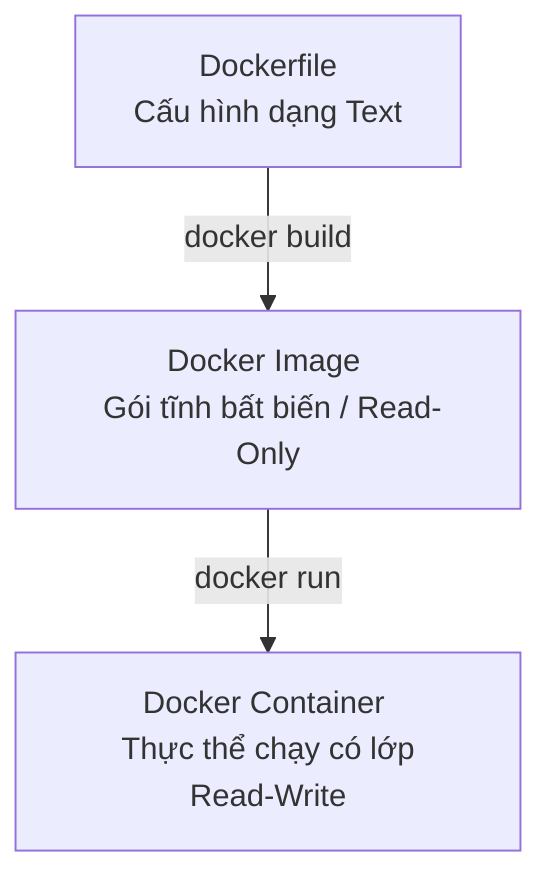

# 📄 Hướng Dẫn Viết Dockerfile Chuyên Nghiệp Từ A Đến Z

Tài liệu này cung cấp hướng dẫn chi tiết, toàn bộ các chỉ dẫn (instructions) cần biết, cùng các mẹo tối ưu hóa (Best Practices) để tạo ra những Dockerfile an toàn, gọn nhẹ và chuẩn Production.

---

## 📌 Mục Lục (Table of Contents)

- [1. Dockerfile là gì?](#1-dockerfile-là-gì)
- [2. Bảng Tra Cứu Chỉ Dẫn Dockerfile (Instruction Cheat Sheet)](#2-bảng-tra-cứu-chỉ-dẫn-dockerfile-instruction-cheat-sheet)
- [3. Đi Sâu Vào Các Khái Niệm Quan Trọng](#3-đi-sâu-vào-các-khái-niệm-quan-trọng)
  - [3.1. Phân biệt `COPY` và `ADD`](#31-phân-biệt-copy-và-add)
  - [3.2. Phân biệt `CMD` và `ENTRYPOINT`](#32-phân-biệt-cmd-và-entrypoint)
  - [3.3. Phân biệt `ARG` và `ENV`](#33-phân-biệt-arg-và-env)
  - [3.4. Bản Chất Và Cơ Chế Hoạt Động Của Chỉ Dẫn `EXPOSE`](#34-bản-chất-và-cơ-chế-hoạt-động-của-chỉ-dẫn-expose)
    - [1. Lệnh `EXPOSE` Thực Sự Làm Gì?](#1-lệnh-expose-thực-sự-làm-gì)
    - [2. So Sánh: Có `EXPOSE` và Không Có `EXPOSE`](#2-so-sánh-có-expose-và-không-có-expose)
    - [3. Ứng Dụng Thực Tế Của `EXPOSE`](#3-ứng-dụng-thực-tế-của-expose)
- [4. Dockerfile Chuẩn Production (Node.js Multi-stage)](#4-dockerfile-chuẩn-production-nodejs-multi-stage)
- [5. Các Nguyên Tắc Vàng Để Dockerfile "Xịn" Hơn](#5-các-nguyên-tắc-vàng-để-dockerfile-xịn-hơn)
  - [1. Luôn tạo file `.dockerignore`](#1-luôn-tạo-file-dockerignore)
  - [2. Sắp xếp thứ tự các câu lệnh khoa học (Docker Layer Caching)](#2-sắp-xếp-thứ-tự-các-câu-lệnh-khoa-học-docker-layer-caching)
  - [3. Giảm số lượng Layer bằng cách gộp lệnh](#3-giảm-số-lượng-layer-bằng-cách-gộp-lệnh)
  - [4. Sử dụng Alpine hoặc Distroless làm Base Image](#4-sử-dụng-alpine-hoặc-distroless-làm-base-image)
- [6. Các Lệnh Docker CLI Cần Biết Để Làm Việc Với Dockerfile](#6-các-lệnh-docker-cli-cần-biết-để-làm-việc-với-dockerfile)
  - [1. Nhóm Lệnh Build Image từ Dockerfile](#1-nhóm-lệnh-build-image-từ-dockerfile)
  - [2. Nhóm Lệnh Xem và Quản Lý Image](#2-nhóm-lệnh-xem-và-quản-lý-image)
  - [3. Nhóm Lệnh Khởi Chạy và Tương Tác với Container](#3-nhóm-lệnh-khởi-chạy-và-tương-tác-với-container)
  - [4. Xem lịch sử xây dựng và dung lượng các Layer](#4-xem-lịch-sử-xây-dựng-và-dung-lượng-các-layer)
- [7. Thực Hành: Dockerfile Cho Dự Án React (Vite)](#7-thực-hành-dockerfile-cho-dự-án-react-vite)
  - [7.1. Khởi tạo Dự án](#71-khởi-tạo-dự-án)
  - [7.2. Chi Tiết File Dockerfile](#72-chi-tiết-file-dockerfile)
  - [7.3. Giải Thích Các Khái Niệm Cốt Lõi](#73-giải-thích-các-khái-niệm-cốt-lõi)
    - [1. Tận Dụng Docker Layer Cache Cho Dependencies (`COPY package*.json ./`)](#1-tận-dụng-docker-layer-cache-cho-dependencies-copy-packagejson)
    - [2. Chuỗi Quản Lý Quyền Sở Hữu (Ownership Chain / Permissions)](#2-chuỗi-quản-lý-quyền-sở-hữu-ownership-chain-permissions)
    - [3. Vai Trò Của Tệp `.dockerignore` (`.dockerignore`)](#3-vai-trò-của-tệp-dockerignore-dockerignore)
  - [7.4. Hướng Dẫn Vận Hành & Khắc Phục Lỗi Thực Tế](#74-hướng-dẫn-vận-hành-khắc-phục-lỗi-thực-tế)
    - [1. Tại sao chạy `docker run -p 5173:5173 react-docker` vẫn báo lỗi?](#1-tại-sao-chạy-docker-run--p-51735173-react-docker-vẫn-báo-lỗi)
    - [2. Vấn đề Hot Reload (Sửa code trên máy host không thay đổi trên UI)](#2-vấn-đề-hot-reload-sửa-code-trên-máy-host-không-thay-đổi-trên-ui)
    - [3. Đăng Tải Image Lên Docker Hub (Docker Registry)](#3-đăng-tải-image-lên-docker-hub-docker-registry)
    - [4. Bảng tra cứu các lệnh Docker CLI quản lý Container](#4-bảng-tra-cứu-các-lệnh-docker-cli-quản-lý-container)
- [8. Câu Hỏi Thường Gặp (Q&A)](#8-câu-hỏi-thường-gặp-qa)

---

## 1. Dockerfile là gì?

**Dockerfile** là một tệp văn bản không có phần mở rộng (extension) chứa một chuỗi các câu lệnh tuần tự. Docker sẽ đọc tệp này để tự động xây dựng (**build**) nên một **Docker Image**.



---

## 2. Bảng Tra Cứu Chỉ Dẫn Dockerfile (Instruction Cheat Sheet)

Dưới đây là toàn bộ các chỉ dẫn thông dụng nhất trong Dockerfile, xếp theo thứ tự sử dụng phổ biến:

| Chỉ dẫn | Chức năng | Ví dụ thực tế | Lời khuyên chuyên nghiệp |
| :--- | :--- | :--- | :--- |
| **`FROM`** | Khai báo Base Image xuất phát. | `FROM node:20-alpine` | Luôn chọn các image tag cụ thể và gọn nhẹ (như `-alpine` hoặc `-slim`). Tránh dùng `latest`. |
| **`WORKDIR`** | Thiết lập thư mục làm việc mặc định bên trong container. | `WORKDIR /app` | Nên khai báo rõ ràng. Nếu thư mục chưa tồn tại, Docker sẽ tự động tạo mới. |
| **`COPY`** | Sao chép tệp/thư mục từ máy host vào container. | `COPY package*.json ./` | Ưu tiên dùng `COPY` thay vì `ADD` cho các thao tác sao chép thông thường. |
| **`ADD`** | Sao chép tệp, hỗ trợ giải nén tự động và tải file từ URL. | `ADD source.tar.gz /app/` | Chỉ dùng `ADD` khi cần tự động giải nén file `.tar` hoặc tải file từ internet. |
| **`RUN`** | Thực thi lệnh trong quá trình build (tạo layer mới). | `RUN npm install && npm cache clean --force` | Kết hợp nhiều lệnh bằng `&&` và dọn dẹp cache trong cùng một dòng để giảm dung lượng Image. |
| **`ENV`** | Định nghĩa biến môi trường sử dụng cả khi build và khi chạy. | `ENV PORT=3000` | Biến này sẽ tồn tại mãi trong container khi chạy thực tế. |
| **`ARG`** | Định nghĩa biến chỉ tồn tại trong quá trình build (Build-time). | `ARG API_URL` | Không lưu thông tin mật (như password) vào đây vì nó có thể bị xem lại qua `docker history`. |
| **`EXPOSE`** | Khai báo cổng mạng container sẽ lắng nghe khi chạy. | `EXPOSE 3000` | Lệnh này chỉ mang tính chất tài liệu hóa (documentation), không tự động mở port ra ngoài máy host. |
| **`CMD`** | Lệnh mặc định chạy khi container khởi động. | `CMD ["node", "server.js"]` | Dễ bị ghi đè nếu người dùng truyền lệnh khác lúc chạy `docker run`. |
| **`ENTRYPOINT`**| Cấu hình container chạy như một file thực thi (Executable). | `ENTRYPOINT ["npm", "start"]` | Khó bị ghi đè hơn `CMD`. Thường kết hợp với `CMD` để truyền tham số mặc định. |
| **`USER`** | Đổi user thực thi các lệnh phía sau. | `USER node` | Luôn chuyển sang một user phi root (như `node`, `appuser`) trước khi chạy ứng dụng để bảo mật. |
| **`VOLUME`** | Tạo điểm gắn ổ đĩa ảo để lưu trữ dữ liệu bền vững. | `VOLUME ["/app/data"]` | Giúp tách biệt dữ liệu cần lưu trữ ra khỏi vòng đời tạm thời của container. |
| **`HEALTHCHECK`**| Kiểm tra tình trạng sức khỏe của ứng dụng trong container. | `HEALTHCHECK --interval=30s CMD curl -f http://localhost:3000/ || exit 1` | Rất quan trọng khi chạy trên Kubernetes hoặc Docker Swarm để tự động khởi động lại container bị treo. |

---

## 3. Đi Sâu Vào Các Khái Niệm Quan Trọng

### 3.1. Phân biệt `COPY` và `ADD`
*   **`COPY`**: Đơn thuần là sao chép tệp cục bộ từ máy của bạn vào container. Rất an toàn và rõ ràng.
*   **`ADD`**: Có thêm các tính năng nâng cao:
    1.  Tải tệp từ một URL từ xa.
    2.  Tự động giải nén các tệp nén (như `.tar`, `.tgz`, `.gzip`, `.zip`) vào thư mục đích.
> [!IMPORTANT]
> **Best Practice:** Theo tài liệu chính thức của Docker, hãy luôn ưu tiên sử dụng `COPY`. Chỉ sử dụng `ADD` khi bạn thực sự cần tự động giải nén một tệp nén cục bộ vào Image.

---

### 3.2. Phân biệt `CMD` và `ENTRYPOINT`
Cả hai đều dùng để khai báo lệnh chạy khi container khởi động, nhưng có cơ chế hoạt động khác nhau:

*   **`CMD`**: Cung cấp lệnh mặc định. Nếu bạn chạy `docker run <image> python app.py`, lệnh `python app.py` sẽ ghi đè hoàn toàn lệnh `CMD` trong Dockerfile.
*   **`ENTRYPOINT`**: Thiết lập một lệnh cố định không thể ghi đè trực tiếp. Nếu bạn chạy `docker run <image> app.py`, thì `app.py` sẽ được truyền vào làm **tham số** cho lệnh trong `ENTRYPOINT`.

**💡 Cách kết hợp đỉnh cao:**
```dockerfile
# Sử dụng ENTRYPOINT làm lệnh chính cố định
ENTRYPOINT ["node"]
# Sử dụng CMD làm tham số mặc định (có thể bị ghi đè)
CMD ["dist/index.js"]
```
*   Nếu chạy mặc định: Container sẽ thực thi `node dist/index.js`.
*   Nếu chạy: `docker run my-image dist/other.js`, container sẽ thực thi `node dist/other.js` (ghi đè tham số của CMD).

---

### 3.3. Phân biệt `ARG` và `ENV`
*   **`ARG` (Build-time variable):** Chỉ tồn tại khi bạn đang build image. Sau khi image build xong, biến này biến mất. Bạn truyền giá trị thông qua: `--build-arg VERSION=1.0.0`.
*   **`ENV` (Runtime environment variable):** Tồn tại cả khi build lẫn khi container đang chạy thực tế. Bạn có thể thay đổi biến này lúc khởi chạy container bằng cách dùng cờ `-e PORT=8080`.

---

### 3.4. Bản Chất Và Cơ Chế Hoạt Động Của Chỉ Dẫn `EXPOSE`

Nhiều người mới học Docker thường hiểu lầm rằng viết `EXPOSE <port>` trong Dockerfile sẽ tự động mở cổng đó từ container ra bên ngoài máy host. Thực tế không phải như vậy.

#### 1. Lệnh `EXPOSE` Thực Sự Làm Gì?
*   **Mang tính tài liệu hóa (Documentation):** `EXPOSE` chỉ đóng vai trò như một lời thông báo/chú thích giữa người viết Dockerfile và người chạy container (hoặc các công cụ tự động hóa). Nó nói rằng: *"Ứng dụng bên trong container này được thiết kế để lắng nghe trên cổng mạng X"*.
*   **Không có tác dụng cấu hình mạng:** Bản thân chỉ dẫn này **không** thực hiện mở bất kỳ cổng nào trên máy host, cũng **không** cấu hình tường lửa hay định tuyến.

#### 2. So Sánh: Có `EXPOSE` và Không Có `EXPOSE`

| Đặc điểm | Có khai báo `EXPOSE 5173` | Không khai báo `EXPOSE 5173` |
| :--- | :--- | :--- |
| **Khi chạy `docker ps`** | Cột `PORTS` hiển thị thông tin cổng (`5173/tcp`) để dễ theo dõi. | Cột `PORTS` để trống (không hiển thị gì). |
| **Dùng lệnh `docker run -p 5173:5173`** | Ánh xạ cổng thành công, máy host truy cập được bình thường. | **Vẫn ánh xạ cổng thành công** và máy host truy cập được bình thường. |
| **Dùng cờ tự động ánh xạ `-P` (viết hoa)** | Docker tự động ánh xạ cổng `5173` của container sang một cổng ngẫu nhiên có sẵn trên máy host (ví dụ: `32768`). | Cờ `-P` không hoạt động với cổng này vì Docker không có thông tin khai báo trước để tự động ánh xạ. |

#### 3. Ứng Dụng Thực Tế Của `EXPOSE`
1.  **Giao tiếp nội bộ giữa các Container (Docker Network):** Nếu các container chạy chung trong một mạng nội bộ (`bridge network`), chúng có thể giao tiếp trực tiếp với nhau thông qua cổng được `EXPOSE` mà không cần ánh xạ cổng ra ngoài máy host bằng tham số `-p`.
2.  **Tích hợp công cụ CI/CD & Orchestration:** Các hệ thống như Kubernetes, Docker Compose, hoặc các công cụ reverse proxy tự động (như Traefik) dựa vào siêu dữ liệu (metadata) của `EXPOSE` để biết container lắng nghe cổng nào nhằm định tuyến traffic tự động.

> [!IMPORTANT]
> **Tóm lại:** Để truy cập được ứng dụng từ trình duyệt máy host của bạn, **bắt buộc** phải sử dụng tham số `-p <cổng_host>:<cổng_container>` khi khởi chạy container (ví dụ `docker run -p 5173:5173 my-image`), bất kể trong Dockerfile có viết `EXPOSE` hay không.

---

## 4. Dockerfile Chuẩn Production (Node.js Multi-stage)

Dưới đây là một Dockerfile mẫu được tối ưu hóa tối đa cho các dự án Node.js/TypeScript sử dụng kỹ thuật **Multi-stage Build**, **Bảo mật phi Root**, và **Dependency Caching**.

```dockerfile
# ==========================================
# GIAI ĐOẠN 1: BUILDER (Môi trường cài đặt & Biên dịch)
# ==========================================
FROM node:20-alpine AS builder

# Thiết lập thư mục làm việc
WORKDIR /usr/src/app

# Tận dụng Docker Cache cho dependencies
COPY package*.json ./

# Cài đặt toàn bộ dependencies (bao gồm cả devDependencies để build code TS)
RUN npm ci

# Copy toàn bộ mã nguồn dự án
COPY . .

# Biên dịch code TypeScript sang JavaScript thành phẩm (tạo ra thư mục dist/)
RUN npm run build

# Dọn dẹp devDependencies, chỉ giữ lại Production Dependencies
RUN npm prune --production


# ==========================================
# GIAI ĐOẠN 2: RUNNER (Môi trường chạy siêu gọn nhẹ)
# ==========================================
FROM node:20-alpine AS runner

# Đặt biến môi trường mặc định là production
ENV NODE_ENV=production
ENV PORT=3000

WORKDIR /usr/src/app

# Chỉ copy những file thực sự cần thiết từ giai đoạn Builder sang
COPY --from=builder /usr/src/app/package*.json ./
COPY --from=builder /usr/src/app/node_modules ./node_modules
COPY --from=builder /usr/src/app/dist ./dist

# Bảo mật: Chuyển quyền chạy sang user 'node' có sẵn trong image alpine
# Tránh chạy với quyền root để ngăn chặn lỗ hổng container breakout
USER node

# Khai báo cổng lắng nghe (cho mục đích tài liệu hóa)
EXPOSE 3000

# Kiểm tra sức khỏe định kỳ cho ứng dụng
HEALTHCHECK --interval=30s --timeout=3s --start-period=5s --retries=3 \
  CMD node -e "require('http').get('http://localhost:' + (process.env.PORT || 3000) + '/health', (res) => { if (res.statusCode === 200) process.exit(0); else process.exit(1); })" || exit 1

# Lệnh khởi chạy ứng dụng
CMD ["node", "dist/index.js"]
```

---

## 5. Các Nguyên Tắc Vàng Để Dockerfile "Xịn" Hơn

### 1. Luôn tạo file `.dockerignore`
Trước khi gửi các tệp lên Docker Daemon để build, Docker sẽ copy toàn bộ thư mục của bạn. Nếu không có `.dockerignore`, các thư mục nặng như `node_modules`, `.git`, `.env` sẽ bị bê vào gây chậm tiến trình build và lộ dữ liệu mật.
> Tạo một file `.dockerignore` cùng cấp với Dockerfile và thêm nội dung sau:
> ```
> node_modules
> npm-debug.log
> dist
> build
> .git
> .env
> .env.*
> README.md
> Dockerfile
> compose.yaml
> ```

### 2. Sắp xếp thứ tự các câu lệnh khoa học (Docker Layer Caching)
Docker build theo cơ chế các lớp (Layers) chồng lên nhau. Nếu một Layer phía trước thay đổi, toàn bộ các Layer phía sau sẽ bị mất cache và phải chạy lại từ đầu.
*   **Sai:** Đặt `COPY . .` trước `RUN npm install`. (Sửa 1 dòng code $\rightarrow$ cài lại node_modules từ đầu).
*   **Đúng:** Copy `package.json` $\rightarrow$ `RUN npm install` $\rightarrow$ Copy code còn lại $\rightarrow$ Build.

### 3. Giảm số lượng Layer bằng cách gộp lệnh
Mỗi lệnh `RUN`, `COPY`, `ADD` sẽ tạo ra một Layer mới làm tăng dung lượng Image.
*   **Không nên:**
    ```dockerfile
    RUN apt-get update
    RUN apt-get install -y curl
    RUN rm -rf /var/lib/apt/lists/*
    ```
*   **Nên dùng:**
    ```dockerfile
    RUN apt-get update && apt-get install -y curl \
        && rm -rf /var/lib/apt/lists/*
    ```

### 4. Sử dụng Alpine hoặc Distroless làm Base Image
*   Image mặc định như `node:20` nặng khoảng **1GB** vì chứa cả hệ điều hành Debian đầy đủ công cụ.
*   Image `node:20-alpine` chỉ nặng khoảng **120MB** vì chạy trên Alpine Linux tinh giản.
*   Giúp giảm thời gian kéo/đẩy Image và hạn chế tối đa các lỗ hổng bảo mật (vulnerabilities) do các gói phần mềm thừa gây ra.

---

## 6. Các Lệnh Docker CLI Cần Biết Để Làm Việc Với Dockerfile

### 1. Nhóm Lệnh Build Image từ Dockerfile
```bash
# Build image và gắn tag (tên) là my-api:1.0.0 từ thư mục hiện tại (.)
docker build -t my-api:1.0.0 .

# Build không sử dụng bộ nhớ đệm (bắt buộc chạy lại toàn bộ lệnh)
docker build --no-cache -t my-api:1.0.0 .

# Truyền biến ARG vào quá trình build
docker build --build-arg API_URL=https://api.example.com -t my-api:1.0.0 .

# Chỉ định rõ tệp cấu hình khác nếu không đặt tên là Dockerfile
docker build -f Dockerfile.dev -t my-api:dev .
```

### 2. Nhóm Lệnh Xem và Quản Lý Image
```bash
# Liệt kê toàn bộ các Docker Image đang có ở máy local
docker images
```

### 3. Nhóm Lệnh Khởi Chạy và Tương Tác với Container
```bash
# Chạy container từ image (ví dụ: hello-docker)
docker run hello-docker

# Chạy container và tự đặt tên gợi nhớ (thay vì để Docker đặt tên ngẫu nhiên)
docker run --name my-container hello-docker

# Khởi chạy container và đi vào bên trong giao diện dòng lệnh (Shell) của container
docker run -it hello-docker sh
```
> [!NOTE]
> **Cách thoát khỏi dòng lệnh (Shell) của Container:**
> *   **Cách 1 (Thoát và dừng container):** Nhập lệnh `exit` rồi nhấn `Enter` (hoặc nhấn phím tắt `Ctrl + D`). Tiến trình shell (PID 1) sẽ kết thúc và container tự động dừng lại.
> *   **Cách 2 (Thoát nhưng giữ container vẫn chạy nền):** Nhấn tổ hợp phím **`Ctrl + P`**, sau đó nhấn tiếp **`Ctrl + Q`**. Bạn sẽ quay trở lại terminal của máy host mà container vẫn tiếp tục chạy ngầm.

### 4. Xem lịch sử xây dựng và dung lượng các Layer
Lệnh này cực kỳ hữu ích để bạn kiểm tra xem layer nào đang chiếm dung lượng lớn nhất nhằm tối ưu hóa lại Dockerfile.
```bash
docker history my-api:1.0.0
```

---

## 7. Thực Hành: Dockerfile Cho Dự Án React (Vite)

Trong phần này, chúng ta sẽ đi sâu phân tích tệp `dockerfile` thực tế của dự án React được khởi tạo bằng công cụ **Vite**. Qua đó làm rõ hai khái niệm nâng cao rất quan trọng: **Tận dụng bộ nhớ đệm (Layer Caching)** và **Chuỗi quản lý quyền sở hữu tệp (Ownership Chain / Permissions)**.

### 7.1. Khởi tạo Dự án
Dự án được khởi tạo bằng công cụ Vite thông qua câu lệnh:
```bash
npm create vite@latest react-docker -- --template react-ts
```
*(Tên thư mục dự án được đặt là `react-docker`, sử dụng template React với TypeScript).*

---

### 7.2. Chi Tiết File Dockerfile
Dưới đây là nội dung đầy đủ của file [dockerfile](./2_2_React_Docker/react-docker/dockerfile) cấu hình cho môi trường Development của dự án:

```dockerfile
# set the base image to create the image for react app
FROM node:20-alpine

# create a user with permissions to run the app
# -S -> create a system user
# -G -> add the user to a group
# This is done to avoid running the app as root
# If the app is run as root, any vulnerability in the app can be exploited to gain access to the host system
# It's a good practice to run the app as a non-root user
RUN addgroup app && adduser -S -G app app

# set the user to run the app
USER app

# set the working directory to /app
WORKDIR /app

# copy package.json and package-lock.json to the working directory
# This is done before copying the rest of the files to take advantage of Docker’s cache
# If the package.json and package-lock.json files haven’t changed, Docker will use the cached dependencies
COPY package*.json ./

# sometimes the ownership of the files in the working directory is changed to root
# and thus the app can't access the files and throws an error -> EACCES: permission denied
# to avoid this, change the ownership of the files to the root user
USER root

# change the ownership of the /app directory to the app user
# chown -R <user>:<group> <directory>
# chown command changes the user and/or group ownership of for given file.
RUN chown -R app:app .

# change the user back to the app user
USER app

# install dependencies
RUN npm install

# copy the rest of the files to the working directory
COPY . .

# expose port 5173 to tell Docker that the container listens on the specified network ports at runtime
EXPOSE 5173

# command to run the app
CMD npm run dev
```

---

### 7.3. Giải Thích Các Khái Niệm Cốt Lõi

#### ⚡ 1. Tận Dụng Docker Layer Cache Cho Dependencies (`COPY package*.json ./`)
Trong Dockerfile trên, dòng lệnh copy dependency định nghĩa như sau:
```dockerfile
# copy package.json and package-lock.json to the working directory
# This is done before copying the rest of the files to take advantage of Docker’s cache
# If the package.json and package-lock.json files haven’t changed, Docker will use the cached dependencies
COPY package*.json ./
```
*   **Tại sao lại copy riêng `package.json` và `package-lock.json` trước?**
    *   Docker xây dựng Image bằng cách xếp chồng các lớp (Layers) tương ứng với từng dòng lệnh. Mỗi layer sẽ được lưu vào bộ nhớ đệm (Cache).
    *   Nếu tệp nguồn của lệnh `COPY` hoặc nội dung của lệnh `RUN` không có bất kỳ thay đổi nào so với lần build trước, Docker sẽ tái sử dụng layer cache thay vì chạy lại từ đầu.
    *   Quá trình chạy `npm install` để cài đặt thư viện thường mất nhiều thời gian và băng thông nhất. Bằng cách tách biệt việc copy `package*.json` và chạy `npm install` lên trên trước khi copy toàn bộ mã nguồn (`COPY . .`), chúng ta đảm bảo rằng **chỉ khi danh sách thư viện trong `package.json` thay đổi** thì Docker mới cài lại dependencies.
    *   Nếu bạn chỉ thay đổi code React thông thường (ví dụ sửa file `App.tsx`), Docker sẽ nhận diện các layer chứa `package.json` và `npm install` vẫn giữ nguyên $\rightarrow$ Docker sử dụng trực tiếp Cache cho các bước này $\rightarrow$ Tốc độ build lại (rebuild) Image chỉ mất **vài giây** thay vì phải đợi cài đặt lại toàn bộ thư viện.

#### 2. Chuỗi Quản Lý Quyền Sở Hữu (Ownership Chain / Permissions)
Hãy quan sát đoạn mã chuyển đổi quyền sở hữu đặc biệt sau:
```dockerfile
# Đang ở quyền user 'app' (thiết lập từ dòng trước đó)
USER app
WORKDIR /app
COPY package*.json ./

# Chuyển tạm thời về quyền 'root'
USER root

# Thay đổi quyền sở hữu thư mục hiện tại sang cho user/group 'app'
RUN chown -R app:app .

# Chuyển ngược lại quyền user 'app'
USER app

RUN npm install
```

*   **Tại sao lại có sự chuyển đổi qua lại giữa `USER root` và `USER app`?**
    1.  **Vấn đề mặc định của lệnh COPY:** Khi chúng ta thực hiện câu lệnh `COPY package*.json ./`, Docker sẽ sao chép các tệp này từ máy host vào container dưới quyền sở hữu mặc định của người dùng tối cao là **`root`** (UID 0, GID 0), bất kể trước đó bạn đã khai báo chỉ dẫn `USER app`.
    2.  **Lỗi phân quyền (`EACCES: permission denied`):** Vì thư mục làm việc và các file `package*.json` thuộc sở hữu của `root`, khi tiến trình dưới quyền `USER app` cố gắng thực hiện cài đặt thư viện (`npm install`), nó cần ghi dữ liệu vào thư mục `/app` (như tạo thư mục `node_modules` và ghi cache). Tiến trình phi root `app` sẽ không có đủ quyền ghi và dẫn đến lỗi crash container hoặc lỗi `Permission Denied`.
    3.  **Giải pháp thực thi:**
        *   Chúng ta bắt buộc phải chuyển ngược lại sang `USER root` để chạy lệnh thay đổi quyền sở hữu (`chown -R app:app .`). Chỉ có tài khoản `root` mới có đủ đặc quyền thay đổi chủ sở hữu của tệp từ `root` sang `app`.
        *   Sau khi chạy `chown` xong để trao toàn quyền thư mục `/app` cho user `app`, chúng ta chuyển ngược lại `USER app` để thực thi lệnh `npm install` và chạy ứng dụng một cách an toàn.

> [!TIP]
> **Cách viết tối ưu hóa (Best Practice) hơn:**
> Thay vì viết dài dòng và chuyển đổi qua lại giữa các user tạo ra thêm nhiều layer trung gian không cần thiết, Docker hiện đại hỗ trợ tham số `--chown` trực tiếp trong chỉ dẫn `COPY`. Bạn có thể thay thế toàn bộ chuỗi lệnh rườm rà trên bằng cách viết tối ưu như sau:
> 
> ```dockerfile
> FROM node:20-alpine
> 
> RUN addgroup app && adduser -S -G app app
> USER app
> WORKDIR /app
> 
> # Sao chép và gán trực tiếp quyền sở hữu cho user app ngay khi copy
> COPY --chown=app:app package*.json ./
> 
> RUN npm install
> 
> # Sao chép toàn bộ mã nguồn còn lại và cũng gán quyền sở hữu cho app
> COPY --chown=app:app . .
> 
> EXPOSE 5173
> CMD ["npm", "run", "dev"]
> ```
> *Cách viết này giúp Dockerfile cực kỳ sạch sẽ, loại bỏ hoàn toàn các dòng `USER root` và `chown -R`.*

#### 3. Vai Trò Của Tệp `.dockerignore` (`.dockerignore`)
Tệp [`.dockerignore`](./2_2_React_Docker/react-docker/.dockerignore) trong dự án được định nghĩa tinh giản:
```text
node_modules
```
*   **Tại sao lại cần loại bỏ `node_modules` khi truyền lên Docker Build Context?**
    1.  **Tránh xung đột môi trường (OS-specific binary compiler):** Thư mục `node_modules` ở máy host được cài đặt tương thích với hệ điều hành máy host (ví dụ Windows). Khi chúng ta build container chạy Linux Alpine, nếu bê nguyên thư mục `node_modules` cũ sang bằng lệnh `COPY . .`, các thư viện biên dịch nhị phân (native binaries) sẽ bị lỗi kiến trúc và dẫn đến crash container.
    2.  **Tối ưu tốc độ build:** Thư mục `node_modules` chứa hàng chục nghìn tệp tin nhỏ và có dung lượng rất lớn. Việc bỏ qua nó giúp giảm thời gian Docker gửi Build Context từ client đến daemon, tăng tốc độ build đáng kể.
    3.  **Đảm bảo tính độc lập:** Việc cài đặt thư viện sạch từ đầu qua lệnh `npm install` bên trong Alpine Linux sẽ giúp hệ điều hành của container tự quản lý và tương thích hoàn toàn.

---

### 7.4. Hướng Dẫn Vận Hành & Khắc Phục Lỗi Thực Tế

Dưới đây là chu trình chạy thử nghiệm, phân tích các lỗi phân quyền, hot reload và các lệnh Docker CLI cần thiết khi làm việc với dự án React:

#### 1. Tại sao chạy `docker run -p 5173:5173 react-docker` vẫn báo lỗi?
*   **Lỗi hiển thị:** `➜  Network: use --host to expose`
*   **Giải thích:** Vite server mặc định chỉ lắng nghe trên IP loopback (`127.0.0.1`) nội bộ của container. Khi bạn chạy port forward, Docker không thể định tuyến traffic từ ngoài vào được.
*   **Giải pháp:** Phải chỉnh lại script `"dev": "vite --host"` trong file `package.json` để Vite lắng nghe ở `0.0.0.0`.
*   **Tại sao phải build lại image mới thành công?**
    *   Vì Docker Image là một snapshot tĩnh và bất biến (Read-only) của source code tại thời điểm build.
    *   Khi bạn thay đổi file `package.json` trên máy host, Docker Image đã build từ trước **không hề tự cập nhật**. Bạn buộc phải chạy lại `docker build -t react-docker .` để đóng gói cấu hình mới vào image.
*   **Kết quả mong đợi:** Sau khi cấu hình `--host` và build lại, chạy container sẽ hiển thị thành công:
    ```text
    ➜  Local:   http://localhost:5173/
    ➜  Network: http://172.17.0.2:5173/
    ```

#### 2. Vấn đề Hot Reload (Sửa code trên máy host không thay đổi trên UI)
*   **Hiện tượng:** Bạn đã sửa tệp `App.tsx` trên máy host nhưng trình duyệt không tự cập nhật (Hot Reload) và code trong container vẫn giữ nguyên.
*   **Giải thích:** Image đã sao chép code ở thời điểm build bằng lệnh `COPY . .`. Do container chạy biệt lập, những thay đổi file ở máy host sau khi container đang chạy hoàn toàn không được đồng bộ vào bên trong.
*   **Giải pháp - Sử dụng Bind Mount (Volumes):**
    Chúng ta cần tạo một liên kết động (mount) thư mục từ máy host vào thư mục `/app` trong container:
    ```bash
    # Lệnh Mount cơ bản (chưa tối ưu):
    docker run -p 5173:5173 -v "$(pwd):/app" react-docker
    ```
    *   **Tại sao lệnh trên vẫn có thể lỗi và cần tối ưu thêm `-v /app/node_modules`?**
        *   Khi mount thư mục hiện tại `$(pwd)` vào `/app` trong container, toàn bộ nội dung của host (bao gồm cả việc thiếu `node_modules` hoặc `node_modules` của Windows) sẽ che lấp (override) thư mục `/app` của container.
        *   Điều này khiến thư mục `node_modules` được cài sẵn cho hệ điều hành Linux Alpine bên trong container bị biến mất hoặc lỗi.
        *   **Giải pháp tối ưu:** Thêm một **Anonymous Volume** `-v /app/node_modules` để báo cho Docker biết: *"Hãy giữ lại thư mục `/app/node_modules` được cài từ quá trình build image và không để thư mục host đè lên nó"*.
    ```bash
    # Lệnh chạy tối ưu hoàn chỉnh:
    docker run -p 5173:5173 -v "$(pwd):/app" -v /app/node_modules react-docker
    ```
    
    > [!IMPORTANT]
    > **Lưu ý đặc biệt cho người dùng Windows (WSL 2 / Hyper-V):**
    > *   **Vấn đề:** Khi sử dụng tính năng Mount Volume trên Windows, các sự kiện thay đổi file của hệ thống (như `inotify` của Linux) đôi khi **không** truyền qua được phân vùng đĩa Windows sang Linux container. Kết quả là mặc dù code bên máy host đã sửa nhưng Vite server bên trong container không biết để load lại UI.
    *   **Cách khắc phục:** Ta cần cấu hình cho Vite chuyển sang cơ chế **Polling (quét tệp tin liên tục)** bằng cách thêm mục `server.watch.usePolling: true` vào file cấu hình [`vite.config.ts`](./2_2_React_Docker/react-docker/vite.config.ts):
    *   ```typescript
        export default defineConfig({
          plugins: [react()],
          server: {
            watch: {
              usePolling: true, // Bật chế độ quét tệp tin định kỳ để nhận diện thay đổi trên Windows host
            },
          },
        })
        ```
    *   *(Sau khi cấu hình và build lại image mới, tính năng Hot Reload / HMR của Vite sẽ hoạt động hoàn hảo trên mọi hệ điều hành).*

#### 3. Đăng Tải Image Lên Docker Hub (Docker Registry)

Khi đã build xong một Docker Image hoàn chỉnh ở máy cục bộ (local), bạn có thể chia sẻ image này lên **Docker Hub** để người khác hoặc các máy chủ deploy có thể tải về và chạy tương tự như một kho chứa mã nguồn (Git Repository).

Các bước thực hiện đăng tải:

1. **Đăng nhập vào Docker Hub:**
   Mở terminal và thực hiện đăng nhập vào tài khoản Docker Hub của bạn (bằng username và password hoặc Access Token):
   ```bash
   docker login
   ```
   *(Nếu bạn đang mở Docker Desktop trên máy tính và đã đăng nhập tài khoản trước đó, Docker CLI sẽ tự động liên kết).*

2. **Gắn thẻ (Tag) lại Image theo đúng tên tài khoản Docker Hub:**
   Để Docker Hub biết được image này thuộc về tài khoản nào, bạn cần tag lại image local theo định dạng `<username_docker_hub>/<tên_image>:<tag>`.
   
   Cú pháp:
   ```bash
   docker tag <tên_image_local> <username_docker_hub>/<tên_image_docker_hub>
   ```
   Ví dụ, nếu tài khoản của bạn là `amalkin39` và bạn muốn đẩy image `react-docker` lên:
   ```bash
   docker tag react-docker amalkin39/react-docker
   ```

3. **Đẩy (Push) Image lên Docker Hub:**
   Thực hiện đẩy image đã gắn thẻ lên registry:
   ```bash
   docker push amalkin39/react-docker
   ```

Sau khi hoàn tất, bất kỳ ai cũng có thể tải trực tiếp image này về chạy ở bất kỳ máy tính nào khác mà không cần phải có sẵn mã nguồn để build lại:
```bash
docker run -p 5173:5173 amalkin39/react-docker
```

#### 4. Bảng tra cứu các lệnh Docker CLI quản lý Container

Khi thực hành chạy container, bạn cần sử dụng các lệnh CLI sau để kiểm soát tài nguyên:

*   **Xem các container đang chạy:**
    ```bash
    docker ps
    ```
*   **Xem toàn bộ các container (cả đang chạy và đã dừng):**
    ```bash
    docker ps -a
    ```
*   **Dừng container đang chạy:**
    ```bash
    docker stop <id_container>
    # Mẹo: Bạn chỉ cần gõ 3 chữ cái đầu tiên của ID (ví dụ: c3d) thay vì gõ cả chuỗi dài
    docker stop c3d
    ```
*   **Xóa bỏ một container:**
    ```bash
    docker rm <id_container>
    # Xóa cưỡng chế (kể cả khi container đang chạy):
    docker rm <id_container> --force
    ```
*   **Dọn dẹp tài nguyên (Xóa toàn bộ container đã dừng để giải phóng đĩa):**
    ```bash
    docker container prune
    ```

## 8. Câu Hỏi Thường Gặp (Q&A)

### Q1: Dấu chấm `.` ở cuối lệnh `docker build -t <image-name> .` nghĩa là gì?
*   **Trả lời:** Dấu chấm `.` đại diện cho **Build Context** (thư mục hiện tại). 
*   **Build Context** là thư mục chứa toàn bộ mã nguồn, tệp cấu hình mà bạn muốn gửi tới Docker Daemon để Docker có thể đọc và sử dụng (thông qua các lệnh như `COPY` hoặc `ADD` trong Dockerfile).
*   Mặc định, Docker cũng sẽ tự động tìm kiếm tệp có tên chính xác là `Dockerfile` trong thư mục Build Context này để tiến hành build.

### Q2: Nếu Docker không tìm thấy tệp Dockerfile trong thư mục chỉ định thì sao?
*   **Trả lời:** Docker sẽ dừng quá trình build và ném ra lỗi tương tự như:
    ```text
    ERROR: failed to solve: failed to read dockerfile: open /var/lib/docker/tmp/buildkit-mount.../Dockerfile: no such file or directory
    ```
*   **Cách khắc phục:**
    1.  **Kiểm tra tên file:** Đảm bảo tệp cấu hình của bạn được đặt tên chính xác là `Dockerfile` hoặc `dockerfile` (không có phần mở rộng như `.txt`, `.docker`, v.v.).
    2.  **Kiểm tra đường dẫn:** Hãy chắc chắn rằng bạn đang mở Terminal/CMD tại đúng thư mục chứa tệp `Dockerfile` trước khi chạy lệnh.
    3.  **Sử dụng cờ `-f` hoặc `--file`:** Nếu bạn đặt tên Dockerfile khác đi (ví dụ: `Dockerfile.dev`, `Dockerfile.prod`) hoặc tệp đó nằm ở thư mục khác, bạn phải chỉ đường dẫn rõ ràng bằng tham số `-f`, nhưng **vẫn cần giữ dấu chấm `.` ở cuối** để xác định Build Context:
        ```bash
        docker build -f Dockerfile.dev -t my-api:dev .
        ```

### Q3: Tại sao container vừa chạy lên khoảng 1 giây là tự động dừng (Status: Exited)? Làm sao để nó chạy mãi?
*   **Trả lời:** 
    *   **Nguyên nhân:** Vòng đời của một Docker container gắn liền với tiến trình chính (PID 1) được định nghĩa trong câu lệnh `CMD` hoặc `ENTRYPOINT` của Dockerfile. Trong ví dụ `hello-docker`, lệnh chính là `node hello.js`. Script này chỉ in ra dòng chữ `"hello docker"` rồi kết thúc ngay lập tức. Khi tiến trình `node` kết thúc, container cũng tự động dừng lại (`Exited`).
    *   **Cách giữ container chạy liên tục:**
        1.  Ứng dụng của bạn phải là một tiến trình chạy nền/lắng nghe liên tục (ví dụ: một web server Node.js/Express lắng nghe cổng mạng, một tác vụ background worker chạy định kỳ, v.v.).
        2.  Nếu muốn container chạy để debug hoặc khám phá hệ thống, bạn có thể ghi đè lệnh khởi chạy mặc định để mở một shell tương tác:
            ```bash
            docker run -it hello-docker sh
            ```
            Lúc này, tiến trình shell `sh` sẽ chạy ở PID 1 và đợi bạn nhập lệnh, giữ cho container luôn ở trạng thái chạy (`Running`).

### Q4: Tại sao tôi không xem được các tệp (Files) của container trong Docker Desktop?
*   **Trả lời:** 
    *   Tính năng duyệt file (tab **Files**) trên Docker Desktop chỉ hoạt động khi container đang ở trạng thái **Running** (Đang chạy).
    *   Khi container đã dừng (`Exited`), Docker Desktop không thể giao tiếp với container để đọc cấu trúc thư mục của nó nữa.
    *   **Cách khắc phục:** Hãy chạy container ở chế độ tương tác (sử dụng shell như lệnh ở Q3): `docker run -it hello-docker sh`, sau đó vào lại Docker Desktop và chọn tab **Files** để khám phá thư mục `/app`.

### Q5: Tại sao tên container của tôi lại hiển thị là các cụm từ tiếng Anh ngẫu nhiên (ví dụ: `hungry_cray`)?
*   **Trả lời:** 
    *   Nếu bạn chạy lệnh `docker run` mà không chỉ định tên cụ thể bằng cờ `--name`, Docker Daemon sẽ tự động đặt cho container một cái tên ngẫu nhiên.
    *   Cơ chế đặt tên này kết hợp ngẫu nhiên giữa một tính từ tiếng Anh (ví dụ: `hungry`, `friendly`, `naughty`) và họ của một nhà khoa học, nhà phát minh hoặc hacker nổi tiếng thế giới (ví dụ: `cray` - Seymour Cray, cha đẻ của siêu máy tính).
    *   **Cách đặt tên container theo ý muốn:** Thêm cờ `--name <tên_container>` khi khởi chạy:
        ```bash
        docker run --name my-hello-container hello-docker
        ```

### Q6: Tại sao ứng dụng React (Vite) khi chạy bằng `docker run` lại báo lỗi `EACCES: permission denied, open '/app/node_modules/.vite-temp/...'`?
*   **Trả lời:** 
    *   **Nguyên nhân:** Lỗi này xảy ra khi tài khoản phi root (`app`) không có quyền ghi vào thư mục `/app/node_modules`. 
    *   Nguyên nhân gốc rễ là tệp `.dockerignore` của bạn ghi `node_modules/` (có dấu gạch chéo ở cuối). Trên hệ điều hành Windows hoặc một số phiên bản Docker BuildKit, cú pháp có dấu gạch chéo cuối này không được nhận diện chính xác, dẫn đến thư mục `node_modules` ở máy host vẫn bị copy vào container khi chạy lệnh `COPY . .`.
    *   Do câu lệnh `COPY . .` mặc định sao chép tệp dưới quyền sở hữu của `root`, thư mục `node_modules` trong container bị đổi chủ sở hữu thành `root:root`. Khi container khởi chạy dưới quyền `USER app`, Vite cố gắng ghi file cấu hình tạm thời vào thư mục này và bị lỗi phân quyền (`EACCES: permission denied`).
    *   **Cách khắc phục:** 
        1. Mở tệp `.dockerignore` và sửa dòng `node_modules/` thành `node_modules` (bỏ dấu gạch chéo ở cuối).
        2. Tiến hành build lại Docker image: `docker build -t react-docker .`
        3. Khởi chạy lại container.

### Q7: Tại sao ứng dụng React (Vite) trong container đã chạy và báo `VITE ready` nhưng tôi truy cập `http://localhost:5173/` từ máy host vẫn báo lỗi không kết nối được?
*   **Trả lời:** 
    *   Vấn đề này xảy ra do hai nguyên nhân độc lập hoặc kết hợp dưới đây:

    *   **Nguyên nhân 1: Vite mặc định chỉ lắng nghe trên `localhost` (127.0.0.1) nội bộ của container**
        *   Mặc định, Vite dev server chỉ ràng buộc (bind) vào địa chỉ IP loopback của container. Điều này có nghĩa là chỉ các tiến trình nằm trong container đó mới truy cập được. Docker Port Forwarding chuyển tiếp lưu lượng từ bên ngoài (card mạng máy host) qua card mạng ảo của container. Nếu server trong container không lắng nghe trên card mạng ảo đó (`0.0.0.0`), yêu cầu kết nối từ host sẽ bị từ chối.
        *   *Dấu hiệu nhận biết:* Logs của Vite ghi dòng chữ: `Network: use --host to expose`.
        *   *Cách khắc phục:* 
            *   **Cách A:** Cập nhật script chạy dev trong tệp `package.json`:
                ```json
                "scripts": {
                  "dev": "vite --host 0.0.0.0"
                }
                ```
            *   **Cách B:** Thêm cấu hình trực tiếp vào tệp `vite.config.ts`:
                ```typescript
                export default defineConfig({
                  server: {
                    host: '0.0.0.0', // hoặc đặt là true
                    port: 5173
                  }
                })
                ```

    *   **Nguyên nhân 2: Chưa thực hiện Port Mapping khi chạy Container**
        *   Chỉ dẫn `EXPOSE 5173` trong Dockerfile thực tế chỉ mang tính chất khai báo tài liệu (documentation). Nó không tự động mở hoặc ánh xạ cổng đó ra ngoài máy host.
        *   *Cách khắc phục:* Khi khởi chạy container bằng lệnh `docker run`, bạn bắt buộc phải chỉ định tham số `-p` hoặc `--publish` để liên kết cổng máy host với cổng container:
            ```bash
            docker run -p 5173:5173 react-docker
            ```
            *(Lúc này, truy cập `http://localhost:5173` từ trình duyệt của máy host sẽ được Docker chuyển tiếp vào cổng `5173` của container).*

---

> [!TIP]
> Hãy tập thói quen chạy thử `docker init` trước để tham khảo cấu hình chuẩn mà Docker đề xuất cho công nghệ bạn đang dùng, từ đó tinh chỉnh thêm để đạt hiệu quả cao nhất.
