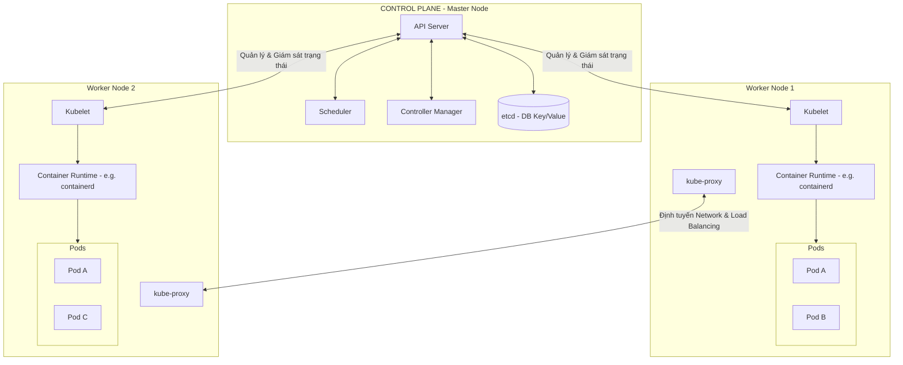

# Hướng Dẫn Học Kubernetes (K8s) - Kiến Trúc & Các Đối Tượng Vận Hành

Tài liệu này cung cấp cái nhìn toàn diện về **Kubernetes (K8s)** dựa trên nội dung thực hành **"DevOps from Zero to Hero: Build and Deploy a Production API"** và bài giảng chuyên sâu **"DevOps Master Class - Part 7 - Containers & Friends"**. Tài liệu đi sâu phân tích kiến trúc, các thành phần cốt lõi và các cơ chế vận hành thực tế trong dự án.

---

## 📌 Mục Lục (Table of Contents)

- [1. Tư Duy Quản Lý: "Đàn Gia Súc" (Cattle) vs "Thú Cưng" (Pets)](#1-tư-duy-quản-lý-đàn-gia-súc-cattle-vs-thú-cưng-pets)
- [2. Phân Tích Kiến Trúc Kubernetes (Kubernetes Architecture)](#2-phân-tích-kiến-trúc-kubernetes-kubernetes-architecture)
  - [2.1. Sơ đồ mô phỏng Cluster](#21-sơ-đồ-mô-phỏng-cluster)
  - [2.2. Thành phần Control Plane (Master Node)](#22-thành-phần-control-plane-master-node)
  - [2.3. Thành phần Worker Nodes](#23-thành-phần-worker-nodes)
- [3. Pod & Vòng Đời - Có Phải Mỗi Pod Chỉ Chứa Một Container?](#3-pod-vòng-đời---có-phải-mỗi-pod-chỉ-chứa-một-container)
  - [3.1. Single-container Pod (Mô hình tiêu chuẩn)](#31-single-container-pod-mô-hình-tiêu-chuẩn)
  - [3.2. Multi-container Pod (Mô hình đa container)](#32-multi-container-pod-mô-hình-đa-container)
  - [3.3. Init Containers (Container Khởi Tạo)](#33-init-containers-container-khởi-tạo)
- [4. Cơ Chế Tự Phục Hồi: Khái Niệm Replicas & Vai Trò Của ReplicaSet](#4-cơ-chế-tự-phục-hồi-khái-niệm-replicas-vai-trò-của-replicaset)
  - [4.1. Replicas (Bản sao) là gì trong Kubernetes?](#41-replicas-bản-sao-là-gì-trong-kubernetes)
  - [4.2. Điều gì xảy ra khi chưa có ReplicaSet (Bare Pod / Static Pod)?](#42-điều-gì-xảy-ra-khi-chưa-có-replicaset-bare-pod-static-pod)
  - [4.3. Khi có ReplicaSet](#43-khi-có-replicaset)
- [5. Service: Giải Quyết Vấn Đề IP Biến Động Của Pods](#5-service-giải-quyết-vấn-đề-ip-biến-động-của-pods)
- [6. Ingress: Cổng Vào HTTP/HTTPS Cho Toàn Bộ Cluster](#6-ingress-cổng-vào-httphttps-cho-toàn-bộ-cluster)
- [7. ConfigMaps & Secrets: Quản Lý Cấu Hình & Bảo Mật Động](#7-configmaps-secrets-quản-lý-cấu-hình-bảo-mật-động)
  - [7.1. Cách chèn cấu hình vào Pod (Injection Methods)](#71-cách-chèn-cấu-hình-vào-pod-injection-methods)
  - [7.2. Sự khác biệt cốt lõi giữa ConfigMap và Secret](#72-sự-khác-biệt-cốt-lõi-giữa-configmap-và-secret)
- [8. So Sánh Các Công Cụ K8s Local: Minikube vs Kind vs K3s](#8-so-sánh-các-công-cụ-k8s-local-minikube-vs-kind-vs-k3s)
  - [8.1. Phân Tích Chi Tiết](#81-phân-tích-chi-tiết)
  - [8.2. Bảng So Sánh & Đề Xuất Lựa Chọn Theo Giai Đoạn](#82-bảng-so-sánh-đề-xuất-lựa-chọn-theo-giai-đoạn)

---

## 1. Tư Duy Quản Lý: "Đàn Gia Súc" (Cattle) vs "Thú Cưng" (Pets)

Để hiểu được triết lý thiết kế của Kubernetes, trước tiên ta cần nắm vững sự khác biệt giữa hai mô hình quản lý máy chủ:

| Đặc tính | 🐱 Thú Cưng (Pets) | 🐂 Đàn Gia Súc (Cattle) |
| :--- | :--- | :--- |
| **Định danh** | Mỗi server có tên riêng biệt, địa chỉ IP cố định (ví dụ: `mail-server`, `db-prod-01`). | Các server được đánh số ngẫu nhiên hoặc đặt tên theo mẫu đồng loạt (ví dụ: `pod-xyz12`, `pod-abc34`). |
| **Bảo trì** | Khi server bị lỗi, kỹ sư sẽ truy cập trực tiếp vào (SSH) để chẩn đoán, vá lỗi, cài cắm thủ công. | Khi server/container bị lỗi, hệ thống đơn giản là hủy nó đi và khởi tạo một cái mới tinh từ image gốc. |
| **Độ độc bản** | Được nâng niu, cấu hình độc nhất. Nếu server này chết, hệ thống có thể bị tê liệt thời gian dài. | Các bản sao giống hệt nhau và hoàn toàn có thể thay thế cho nhau (interchangeable). |
| **Đại diện** | Các máy chủ truyền thống (Bare-metal, VM cấu hình thủ công). | **Containers & Pods trong Kubernetes.** |

> [!IMPORTANT]
> **Kubernetes đối xử với Container và Pod như "Đàn Gia Súc".**
> Khi chạy ứng dụng trên K8s, ta không bao giờ cố gắng sửa chữa một container đang chạy bị lỗi. Ta cấu hình để K8s tự động phát hiện lỗi, tiêu diệt (terminate) và dựng lại một container mới thay thế chỉ trong mili giây.

---

## 2. Phân Tích Kiến Trúc Kubernetes (Kubernetes Architecture)

Dưới đây là phần giải thích chi tiết cho sơ đồ vận hành của một **Kubernetes Cluster**:

### 2.1. Sơ đồ mô phỏng Cluster
Sơ đồ dưới đây mô tả cách các thành phần trong **Control Plane** (Hệ thống điều khiển trung tâm) tương tác với các **Worker Nodes** (Nơi trực tiếp chạy các ứng dụng):



---

### 2.2. Thành phần Control Plane (Master Node)
**Control Plane** đóng vai trò là "bộ não" điều khiển toàn bộ cluster. Nó chịu trách nhiệm đưa ra các quyết định toàn cục (như lập lịch chạy ứng dụng), phát hiện và phản hồi các sự kiện trong cụm.

*   **API Server (`kube-apiserver`):**
    *   **Khái niệm:** Là cổng giao tiếp chính (Gateway) của Control Plane. Tất cả các tương tác (từ Admin sử dụng CLI `kubectl`, hoặc giữa các thành phần nội bộ) đều phải thông qua API Server.
    *   **Nhiệm vụ:** Tiếp nhận các yêu cầu cấu hình YAML, kiểm tra quyền truy cập (Authentication/Authorization) và lưu trữ thông tin vào database `etcd`.
*   **Scheduler (`kube-scheduler`):**
    *   **Khái niệm:** Bộ lập lịch tự động.
    *   **Nhiệm vụ:** Tìm kiếm các Pod mới được tạo nhưng chưa được gán cho Node nào. Nó sẽ tính toán tài nguyên yêu cầu (CPU, RAM), kiểm tra dung lượng trống của từng Worker Node để đưa ra quyết định đặt Pod vào Node phù hợp nhất.
*   **Controller Manager (`kube-controller-manager`):**
    *   **Khái niệm:** Bộ điều khiển trạng thái.
    *   **Nhiệm vụ:** Chạy các tiến trình giám sát (control loops) để liên tục so sánh trạng thái thực tế của cluster với trạng thái mong muốn (Desired State) được khai báo. Nếu có sự lệch pha (ví dụ: thiếu Pod do crash), nó sẽ phát lệnh tạo thêm để bù đắp.
*   **etcd:**
    *   **Khái niệm:** Cơ sở dữ liệu key-value phân tán, có tính nhất quán và sẵn sàng cao.
    *   **Nhiệm vụ:** Lưu trữ toàn bộ dữ liệu cấu hình, trạng thái của cluster và thông tin của mọi tài nguyên chạy trong K8s. Đây là "nguồn thông tin chân lý duy nhất" (Single Source of Truth) của K8s Cluster.

---

### 2.3. Thành phần Worker Nodes
**Worker Nodes** là các máy chủ vật lý hoặc máy ảo trực tiếp chạy các ứng dụng container hóa được đóng gói bên trong các Pod.

*   **Kubelet:**
    *   **Khái niệm:** Là một "đại lý" hay "nhân viên giám sát" chạy trên mỗi Worker Node.
    *   **Nhiệm vụ:** Đọc các thông số kỹ thuật của Pod (PodSpecs) được gửi từ API Server và làm việc trực tiếp với *Container Runtime* để đảm bảo các container được khai báo trong Pod hoạt động bình thường và khỏe mạnh.
*   **kube-proxy:**
    *   **Khái niệm:** Thành phần xử lý mạng lưới kết nối nội bộ và định tuyến trên mỗi Node.
    *   **Nhiệm vụ:** Duy trì các quy tắc mạng (network rules) trên các node. Nó chịu trách nhiệm chuyển tiếp lưu lượng truy cập (networking & routing) từ bên ngoài hoặc giữa các Pod với nhau, đồng thời hỗ trợ cân bằng tải (load balancing) cơ bản cho các Service.
*   **Container Runtime:**
    *   **Khái niệm:** Phần mềm chịu trách nhiệm chạy các container (phổ biến nhất hiện nay là `containerd`, `CRI-O` hoặc trước đây là `Docker`).
    *   **Nhiệm vụ:** Tải ảnh container (pull image), khởi chạy container, dừng container theo lệnh điều phối của Kubelet.

---

## 3. Pod & Vòng Đời - Có Phải Mỗi Pod Chỉ Chứa Một Container?

Một câu hỏi rất phổ biến khi tiếp cận Kubernetes là: **Mỗi Pod có phải chỉ chứa duy nhất một container hay không?**

> **Câu trả lời là: Không bắt buộc.**
> Pod có thể chứa **một container** hoặc **nhiều container** chạy chung với nhau. Tuy nhiên, chúng ta cần phân biệt rõ các trường hợp sử dụng:

### 3.1. Single-container Pod (Mô hình tiêu chuẩn)
*   **Đặc điểm:** Đây là mô hình phổ biến nhất (chiếm tới 95% thực tế). Mỗi Pod chỉ chạy đúng một container duy nhất thực hiện nhiệm vụ của ứng dụng (ví dụ: Node.js API, React Frontend, PostgreSQL DB).
*   **Lợi ích:** Dễ quản lý, dễ scale độc lập (ví dụ: muốn tăng tải API thì chỉ cần tăng số lượng Pod API mà không ảnh hưởng tới DB).

### 3.2. Multi-container Pod (Mô hình đa container)
Khi hai hoặc nhiều container có mối quan hệ cực kỳ khăng khít, bắt buộc phải chạy cùng nhau, chúng ta sẽ bọc chúng chung một Pod. Các container này sẽ:
*   **Chung địa chỉ IP & Port space:** Giao tiếp nội bộ siêu nhanh thông qua địa chỉ `localhost:[port]`.
*   **Chung ổ đĩa (Volume):** Đọc/Ghi trực tiếp vào cùng một thư mục ổ đĩa vật lý được gắn kết chung.
*   **Chung Node vật lý:** Luôn được lập lịch chạy chung trên một máy chủ duy nhất.

Mẫu thiết kế multi-container phổ biến nhất là **Sidecar Pattern**:
*   **Main Container:** Chạy ứng dụng chính (ví dụ: Web App).
*   **Sidecar Container:** Chạy ứng dụng phụ hỗ trợ (ví dụ: một container thu thập log của Web App đẩy lên Elasticsearch, hoặc một proxy bảo mật lọc dữ liệu đầu vào).

```
┌────────────────────────────────────────────────────────┐
│                        POD                             │
│  ┌───────────────────────┐   ┌───────────────────────┐ │
│  │   Main Container      │   │   Sidecar Container   │ │
│  │ (Port 80 - API Server)│   │(Port 90 - Log Shipper)│ │
│  └───────────┬───────────┘   └───────────▲───────────┘ │
│              │                           │             │
│              └────> Ghi Logs vào file ───┘             │
│                                                        │
│  Shared Network Namespace (Cùng IP, localhost)         │
│  Shared Storage Volume (Thư mục log chung)             │
└────────────────────────────────────────────────────────┘
```

### 3.3. Init Containers (Container Khởi Tạo)
*   **Khái niệm:** Là một loại container đặc biệt chạy **trước** các container ứng dụng chính trong Pod.
*   **Đặc điểm:** Init Containers phải chạy và kết thúc (thành công) hoàn toàn thì Container chính mới được phép khởi động.
*   **Ứng dụng:**
    *   Chạy script kiểm tra xem cơ sở dữ liệu đã sẵn sàng chưa trước khi khởi động API chính.
    *   Tải các tệp cấu hình hoặc dữ liệu cần thiết từ bên ngoài (git, S3) về thư mục dùng chung của Pod.
    *   Thiết lập các quyền hạn thư mục (permissions) đặc biệt mà container ứng dụng chính không có quyền thực hiện.

---

## 4. Cơ Chế Tự Phục Hồi: Khái Niệm Replicas & Vai Trò Của ReplicaSet

Để hiểu cách Kubernetes vận hành ổn định trên môi trường sản xuất (production), chúng ta cần nắm rõ khái niệm **Replicas** (bản sao) và tại sao các bộ điều phối (Controllers) như **ReplicaSet** hay **Deployment** lại vô cùng quan trọng.

### 4.1. Replicas (Bản sao) là gì trong Kubernetes?

Trong Kubernetes, **Replicas** là các bản sao giống hệt nhau của cùng một Pod, chạy đồng thời để phục vụ cho cùng một ứng dụng/dịch vụ.

#### Tại sao cần chạy nhiều Replicas?
*   **Tăng tính sẵn sàng cao (High Availability):** Nếu một Pod hoặc một Worker Node bị sập (do lỗi phần cứng, mất kết nối mạng, tràn bộ nhớ), các Pod bản sao chạy trên các Node khác vẫn hoạt động để phục vụ người dùng mà không gây gián đoạn dịch vụ.
*   **Cân bằng tải (Load Balancing):** K8s Service sẽ tự động chia đều lưu lượng truy cập (traffic) của người dùng đến tất cả các Pod bản sao này, giúp hệ thống chịu tải tốt hơn và giảm nguy cơ sập do quá tải một máy chủ đơn lẻ.
*   **Cập nhật không gián đoạn (Zero-Downtime Deployment):** Khi bạn deploy phiên bản mới, K8s sẽ cập nhật dần dần từng bản sao một (Rolling Update) để tại bất kỳ thời điểm nào cũng luôn có bản sao sẵn sàng chạy.

#### Cơ chế duy trì số lượng Replicas (Desired State vs. Actual State)
Kubernetes hoạt động dựa trên cơ chế liên tục so sánh và điều hòa trạng thái:
*   **Desired State (Trạng thái mong muốn):** Số lượng bản sao bạn khai báo trong file YAML (ví dụ: `replicas: 2` hoặc `replicas: 3` trong Deployment).
*   **Actual State (Trạng thái thực tế):** Số lượng Pod thực tế đang sống và chạy trong cụm (cluster).
*   **Reconciliation Loop (Vòng lặp tự điều hòa):** Controller Manager của Kubernetes liên tục giám sát cluster để đảm bảo hai trạng thái này khớp nhau:
    *   Nếu **Actual < Desired** (ví dụ: bạn muốn 3 bản sao nhưng có 1 Pod bị crash hoặc sập Node): K8s lập tức tạo thêm Pod mới để thay thế.
    *   Nếu **Actual > Desired** (ví dụ: bạn thay đổi cấu hình scale-down từ 3 xuống 2): K8s sẽ chủ động tắt bớt Pod dư thừa để giải phóng tài nguyên.

---

### 4.2. Điều gì xảy ra khi chưa có ReplicaSet (Bare Pod / Static Pod)?

Hãy hình dung kịch bản khi ta **chỉ triển khai các Pod đơn lẻ trực tiếp (Bare Pod)** mà không thông qua bất kỳ bộ quản lý nào:

```
                  ┌────────────────────────┐
                  │    Kubernetes Node     │
                  │ ┌────────────────────┐ │
                  │ │    Bare Pod A      │ │  <--- Node gặp sự cố phần cứng (Crash)
                  │ │  (No Controller)   │ │       hoặc Pod bị lỗi chết hẳn
                  │ └────────────────────┘ │
                  └────────────────────────┘
                               │
                               ▼
                    [ Mất Dữ Liệu & API Chết ]
            K8s không tự khởi tạo lại Bare Pod ở Node khác
```

1.  **Không có tính năng Tự Phục Hồi (Self-healing) ở mức Node:** Nếu Worker Node chứa Pod đó bị mất điện, lỗi phần cứng, hoặc bị xóa đột ngột, Pod sẽ chết vĩnh viễn. Không có thành phần nào đứng ra tự tạo lại Pod đó trên Node khác.
2.  **Không thể Scale tự động:** Bạn không thể khai báo "Tôi muốn chạy 3 bản sao". Nếu muốn 3 cái, bạn phải viết 3 file cấu hình Pod khác nhau với 3 cái tên khác nhau và deploy thủ công.
3.  **Lỗi ứng dụng dẫn đến mất dịch vụ:** Khi Pod bị xóa nhầm bởi quản trị viên, hệ thống sẽ mất đi tiến trình đó mà không có cơ chế tự động bù đắp.

---

### 4.3. Khi có ReplicaSet

*   **ReplicaSet** là một controller giám sát. Nó liên tục kiểm tra số lượng Pod thực tế đang chạy so với số lượng bản sao mong muốn (`replicas`).
*   Nếu bạn khai báo `replicas: 3`, ReplicaSet sẽ đảm bảo luôn luôn có đúng 3 Pod hoạt động.
*   Nếu 1 Pod bị chết do Node lỗi, ReplicaSet sẽ ngay lập tức phát lệnh cho Scheduler tìm kiếm Node khác khỏe mạnh để **khởi tạo ngay 1 Pod mới thay thế**, duy trì trạng thái 3 bản sao ổn định.

> [!NOTE]
> Trong thực tế, chúng ta hiếm khi tạo trực tiếp ReplicaSet. Chúng ta sử dụng **Deployment**.
> **Deployment** là một cấp trừu tượng cao hơn, quản lý ReplicaSet phía dưới để hỗ trợ các tính năng như **Rolling Updates** (cập nhật ứng dụng không downtime) và **Rollback** (quay lại phiên bản cũ khi phiên bản mới lỗi).

---

## 5. Service: Giải Quyết Vấn Đề IP Biến Động Của Pods

Như đã phân tích ở trên, Pod là "đàn gia súc" - chúng có thể bị khai tử và tạo mới bất cứ lúc nào. Mỗi lần tái sinh, Pod sẽ nhận được một **địa chỉ IP nội bộ hoàn toàn mới**.

### Vấn đề:
Nếu ứng dụng Frontend cần gọi ứng dụng API (Backend) và bạn cấu hình Frontend trỏ trực tiếp tới IP của Pod API (ví dụ: `http://10.244.1.45:8080`), thì ngay khi Pod API bị restart do lỗi, IP của nó đổi sang `10.244.2.89`, liên kết của Frontend sẽ bị đứt gãy ngay lập tức.

### Giải pháp: Kubernetes Service
**Service** là một đối tượng cung cấp một **Endpoint cố định vĩnh viễn** đại diện cho một nhóm các Pod.

```
                     ┌──────────────────┐
                     │  Client/Frontend │
                     └────────┬─────────┘
                              │ Gọi qua DNS ổn định:
                              │ http://backend-service:8080
                              ▼
                 ┌──────────────────────────┐
                 │    Kubernetes Service    │ <--- IP & DNS CỐ ĐỊNH VĨNH VIỄN
                 │    (backend-service)     │
                 └────────────┬─────────────┘
                              │
             ┌────────────────┼────────────────┐
             │ (Cân bằng tải) │ (Cân bằng tải) │
             ▼                ▼                ▼
      ┌─────────────┐  ┌─────────────┐  ┌─────────────┐
      │   Pod API   │  │   Pod API   │  │   Pod API   │ <--- IP THAY ĐỔI LIÊN TỤC
      │ (10.244.1.5)│  │ (10.244.2.6)│  │ (10.244.3.7)│
      └─────────────┘  └─────────────┘  └─────────────┘
```

### Các đặc tính cốt lõi của Service:
1.  **IP và DNS cố định (Permanent Endpoint):** K8s gán cho mỗi Service một địa chỉ IP ảo cố định (`ClusterIP`) và một tên DNS tương ứng trong cụm (ví dụ: `http://backend-service.default.svc.cluster.local`). Địa chỉ này không bao giờ thay đổi trong suốt vòng đời của Service.
2.  **Cơ chế chọn Pod linh hoạt (Selector & Labels):** Service liên kết với các Pod thông qua các nhãn (`labels`). Bất cứ Pod nào có nhãn khớp với nhãn yêu cầu của Service (`selector`) sẽ tự động được đưa vào danh sách đích đến để nhận traffic.
3.  **Tự động cập nhật Endpoint (Endpoints / EndpointSlice):** Khi một Pod cũ chết và Pod mới được tạo ra với IP mới, K8s Control Plane sẽ tự động cập nhật danh sách IP này vào cấu hình Service. Ứng dụng khách gọi Service sẽ không hề biết hay bị ảnh hưởng bởi sự thay đổi IP này.
4.  **Cân bằng tải tích hợp (Load Balancing):** Service tự động phân phối đều các yêu cầu mạng (round-robin) đến các Pod đang hoạt động khỏe mạnh ở phía sau.

---

## 6. Ingress: Cổng Vào HTTP/HTTPS Cho Toàn Bộ Cluster

Mặc dù `Service` giải quyết tốt bài toán kết nối trong nội bộ cụm K8s, nhưng việc đưa ứng dụng ra môi trường Internet (External Access) sẽ gặp hạn chế nếu chỉ dùng Service:
*   Nếu dùng Service loại `NodePort`: Cổng kết nối bị giới hạn trong khoảng `30000 - 32767` (thiếu chuyên nghiệp, ví dụ: `example.com:31254`).
*   Nếu dùng Service loại `LoadBalancer`: Mỗi Service sẽ yêu cầu Cloud Provider (AWS, Azure) cấp 1 Load Balancer vật lý riêng. Nếu hệ thống có 50 microservices, chi phí thuê 50 Load Balancer sẽ cực kỳ đắt đỏ.

### Giải pháp: Ingress
**Ingress** hoạt động như một API Gateway hay một bộ định tuyến thông minh đặt ở cổng vào của Cluster.

```
                           Lưu lượng HTTP/HTTPS từ Internet
                                          │
                                          ▼
                             ┌────────────────────────┐
                             │    Ingress Controller  │ (Sử dụng 1 IP Public duy nhất)
                             │   (Nginx / Traefik...) │
                             └───────────┬────────────┘
                                         │
                 ┌───────────────────────┴───────────────────────┐
                 │ Định tuyến dựa trên Domain hoặc Path         │
                 ▼ (ví dụ: /api)                                ▼ (ví dụ: /)
     ┌───────────────────────┐                      ┌───────────────────────┐
     │    backend-service    │                      │   frontend-service    │
     └───────────┬───────────┘                      └───────────┬───────────┘
                 │                                              │
        ┌────────┴────────┐                            ┌────────┴────────┐
        ▼                 ▼                            ▼                 ▼
     Pod API 1        Pod API 2                    Pod Front 1      Pod Front 2
```

### Các ưu điểm vượt trội của Ingress:
1.  **Định tuyến thông minh dựa trên Domain (Host-based Routing):**
    *   Trỏ `api.example.com` về `backend-service`.
    *   Trỏ `app.example.com` về `frontend-service`.
2.  **Định tuyến dựa trên Đường dẫn (Path-based Routing):**
    *   Trỏ `example.com/api/*` về `backend-service`.
    *   Trỏ `example.com/*` về `frontend-service`.
3.  **Tập trung quản lý chứng chỉ SSL/TLS (SSL/TLS Termination):**
    *   Chứng chỉ HTTPS (SSL) được cấu hình và giải mã trực tiếp tại Ingress. Lưu lượng truyền tải từ Ingress vào các service bên trong cụm sẽ đi qua HTTP thông thường, giúp giảm tải CPU xử lý mã hóa cho các ứng dụng con.
4.  **Tiết kiệm tài nguyên:** Chỉ cần duy nhất 1 địa chỉ IP Public và 1 Load Balancer của Cloud Provider ở ngoài cùng để gánh toàn bộ lưu lượng truy cập cho hàng trăm Service bên trong.

---

## 7. ConfigMaps & Secrets: Quản Lý Cấu Hình & Bảo Mật Động

Để đảm bảo nguyên tắc Docker Image chỉ cần build 1 lần và có thể chạy ở mọi nơi (Build Once, Run Anywhere), ta phải tách toàn bộ cấu hình môi trường ra khỏi mã nguồn của container. K8s hỗ trợ việc này thông qua **ConfigMaps** và **Secrets**.

### 7.1. Cách chèn cấu hình vào Pod (Injection Methods)
K8s cung cấp hai phương thức phổ biến để đưa ConfigMap và Secret vào container khi chạy:

1.  **Biến Môi Trường (Environment Variables):**
    *   **Cách thức:** K8s đọc giá trị từ ConfigMap/Secret rồi gán thẳng vào các biến môi trường của Container (ví dụ: `DATABASE_HOST`, `PORT`).
    *   **Ưu điểm:** Đơn giản, code ứng dụng dễ dàng đọc thông qua `process.env` (Node.js) hoặc `os.getenv` (Python).
    *   **Nhược điểm:** Nếu giá trị ConfigMap thay đổi, Container phải được khởi động lại (restart) thì mới nhận được giá trị mới.
2.  **Tập tin mount (Volume Mounts):**
    *   **Cách thức:** K8s sẽ mount ConfigMap/Secret thành các tệp tin vật lý nằm trong một thư mục bên trong container (ví dụ: một file cấu hình `/app/config/config.json`).
    *   **Ưu điểm:** Khi bạn cập nhật ConfigMap trên K8s, dữ liệu file bên trong container sẽ tự động đồng bộ sau vài chục giây mà không cần khởi động lại Pod (Hot Reload).

---

### 7.2. Sự khác biệt cốt lõi giữa ConfigMap và Secret

| Đặc tính | 📝 ConfigMap | 🔑 Secret |
| :--- | :--- | :--- |
| **Mục đích** | Lưu cấu hình thông thường không nhạy cảm (ví dụ: Hostname, Port, Log level, config file). | Lưu thông tin nhạy cảm (Mật khẩu DB, Private Key, JWT Secret, Token API). |
| **Mã hóa lưu trữ** | Dạng text thuần (Plaintext). | Được mã hóa Base64 mặc định (Base64 chỉ là encode, không phải encryption, nhưng K8s hỗ trợ mã hóa lưu trữ ở tầng `etcd` và bảo mật bằng RBAC). |
| **Bộ nhớ thực thi trên Node** | Ghi vào ổ đĩa vật lý của Worker Node. | Được lưu trữ dưới dạng **`tmpfs`** (ổ đĩa RAM ảo) trên Worker Node. Thông tin nhạy cảm sẽ tự động mất sạch khi Pod bị xóa và không bao giờ bị ghi xuống đĩa cứng vật lý của Node, tránh việc bị rò rỉ dữ liệu. |

---

## 8. So Sánh Các Công Cụ K8s Local: Minikube vs Kind vs K3s

Khi học tập hoặc phát triển ứng dụng K8s tại local (máy cá nhân), ta không thể thuê các cụm cloud lớn đắt đỏ. Dưới đây là 3 công cụ K8s gọn nhẹ phổ biến nhất, đáp ứng các mục tiêu khác nhau:

### 8.1. Phân Tích Chi Tiết

#### 1. Minikube (Môi trường Sandbox đầy đủ tính năng)
*   **Kiến trúc:** Khởi chạy một Kubernetes Cluster (thường là đơn node) chạy trực tiếp trong một máy ảo (Virtual Machine như VirtualBox, Hyper-V) hoặc chạy trong một Docker Container lớn.
*   **Điểm mạnh:**
    *   Hỗ trợ thư viện Addons rất phong phú: chỉ cần chạy lệnh `minikube addons enable ingress` hoặc `dashboard` là có sẵn các tính năng cấu hình nâng cao.
    *   Mô phỏng rất sát môi trường thực tế của một máy chủ VM.
*   **Điểm yếu:** Khá nặng nề, tốn nhiều RAM và CPU để duy trì máy ảo. Thời gian khởi động khá lâu (vài phút).

#### 2. Kind (Kubernetes in Docker - Cực nhanh cho Automation)
*   **Kiến trúc:** Sử dụng các Docker Container đóng vai trò là các "K8s Node". Nếu bạn muốn cụm 3 node (1 master, 2 workers), Kind sẽ tạo ra đúng 3 Docker containers chạy nền kết nối với nhau.
*   **Điểm mạnh:**
    *   Thời gian khởi động siêu tốc (chỉ tính bằng giây).
    *   Cực kỳ nhẹ vì tận dụng engine Docker có sẵn trên máy.
    *   Hỗ trợ tạo cụm Multi-node local rất dễ dàng.
    *   Là công cụ chuẩn hóa để chạy kiểm thử tự động (Automation Integration Tests) trong các hệ thống CI/CD như GitHub Actions.
*   **Điểm yếu:** Thiếu các addon tự động ăn sẵn như Minikube, người dùng phải tự cài đặt cấu hình thủ công (như cài Ingress controller bằng file YAML).

#### 3. K3s (Kubernetes tối giản cho Production thực tế và IoT)
*   **Kiến trúc:** Được phát triển bởi Rancher. K3s là bản phân phối Kubernetes được lược bỏ toàn bộ các code cũ dư thừa, các driver cloud provider không cần thiết và gộp tất cả thành 1 file chạy duy nhất (Binary) nặng chưa đầy 100MB. Thay vì dùng `etcd` nặng nề, K3s sử dụng mặc định database nhẹ hơn là `SQLite` (vẫn hỗ trợ chuyển sang etcd/Postgres khi cần).
*   **Điểm mạnh:**
    *   Tiêu hao cực kỳ ít tài nguyên (chỉ cần dưới 512MB RAM là có thể chạy được).
    *   Là phiên bản K8s được chứng chỉ bảo mật và sẵn sàng chạy cho môi trường thực tế (Production-ready).
*   **Điểm yếu:** Lược bỏ một số tính năng nâng cao hoặc Driver lưu trữ cũ của bản K8s gốc (để tối ưu dung lượng).

---

### 8.2. Bảng So Sánh & Đề Xuất Lựa Chọn Theo Giai Đoạn

| Tiêu chí | 📦 Minikube | 🐳 Kind | 🚀 K3s |
| :--- | :--- | :--- | :--- |
| **Cách chạy** | VM hoặc Docker container. | Chỉ chạy qua Docker container. | Chạy trực tiếp dưới dạng Systemd service / Binary trên OS. |
| **Số lượng Node** | Thường là Single Node. | Dễ dàng chạy Multi-node. | Dễ dàng dựng Cluster từ Single đến Multi-node. |
| **Database phụ trợ** | `etcd` (Mặc định của K8s). | `etcd`. | `SQLite` (Mặc định), có thể đổi lên `etcd` hoặc `PostgreSQL`. |
| **Tải tài nguyên** | Nặng (RAM > 2GB - 4GB). | Rất nhẹ (RAM ~ 1GB - 2GB). | Siêu nhẹ (RAM ~ 512MB). |

### 💡 Đề xuất sử dụng theo từng giai đoạn phát triển dự án:

1.  **Giai đoạn Bắt Đầu Học & Thử Nghiệm Local (Learning & Dev Sandbox):**
    *   **Nên chọn:** **Minikube**.
    *   **Lý do:** Minikube cung cấp trải nghiệm "mì ăn liền" rất tốt. Bạn có thể dễ dàng bật Dashboard trực quan để quan sát, bật tính năng Ingress chỉ bằng 1 câu lệnh mà không cần phải vật lộn cấu hình YAML phức tạp.
2.  **Giai đoạn Viết Script Test Tự Động & CI/CD Pipelines (CI/CD & Integration Testing):**
    *   **Nên chọn:** **Kind**.
    *   **Lý do:** Kind khởi động cực nhanh và chạy trực tiếp trên Docker. Khi chạy CI/CD (ví dụ GitHub Actions), việc khởi chạy một máy ảo VM của Minikube là không khả thi và rất chậm. Kind giúp dựng nhanh cụm K8s đa node ảo để chạy test code rồi xóa đi ngay lập tức.
3.  **Giai đoạn Staging/Production cho dự án Vừa và Nhỏ hoặc Thiết bị Edge (IoT/Edge Production):**
    *   **Nên chọn:** **K3s**.
    *   **Lý do:** Nếu bạn thuê 1 VPS cấu hình yếu (ví dụ 1 Core CPU, 1GB RAM) để deploy ứng dụng thực tế cho khách hàng, K8s gốc sẽ nuốt sạch tài nguyên trước khi bạn kịp chạy app. K3s sinh ra để chạy mượt mà trên các VPS giá rẻ hoặc thiết bị nhúng (như Raspberry Pi) mà vẫn giữ nguyên vẹn toàn bộ API chuẩn của Kubernetes.
