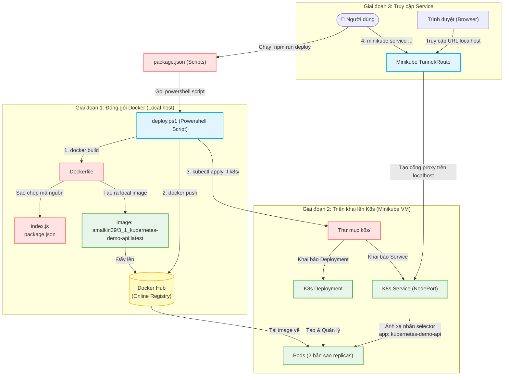

# Hướng dẫn Kubernetes Demo (Phần 1: Chuẩn bị & Triển khai)

Tài liệu này ghi lại chi tiết các bước chuẩn bị ứng dụng, đóng gói container và triển khai lên cụm Kubernetes (sử dụng Minikube).

---

## GIAI ĐOẠN 1: CHUẨN BỊ ỨNG DỤNG & ĐÓNG GÓI DOCKER

### Bước 1: Khởi tạo Project & Cài đặt Express
Trước tiên, chúng ta cần cài đặt thư viện Web Framework **Express** cho ứng dụng Node.js của mình:
```bash
# Cài đặt thư viện Express và lưu thông tin dependency vào file package.json
npm install express
```

### Bước 2: Cài đặt công cụ kubectl (Kubernetes Command-Line Tool)
`kubectl` là công cụ dòng lệnh giúp chúng ta tương tác trực tiếp với cụm Kubernetes (Cluster).
1. Truy cập trang tài liệu chính thức để tìm hiểu thêm: [Cài đặt kubectl trên Windows](https://kubernetes.io/docs/tasks/tools/install-kubectl-windows/).
2. Chạy lệnh dưới đây tại thư mục dự án để tải file thực thi `kubectl.exe` về máy:
   ```powershell
   # Tải file thực thi kubectl.exe phiên bản v1.37.0 từ máy chủ chính thức của Kubernetes
   curl.exe -LO "https://dl.k8s.io/release/v1.37.0/bin/windows/amd64/kubectl.exe"
   ```
3. Kiểm tra xem `kubectl` đã được cài đặt và chạy thành công ở máy khách chưa:
   ```bash
   # Kiểm tra phiên bản của Client kubectl để xác nhận cài đặt thành công
   kubectl version --client
   ```

### Bước 3: Cài đặt và cấu hình Minikube
`minikube` là một cụm Kubernetes cục bộ (local cluster) chạy trong môi trường máy cá nhân của bạn thông qua một máy ảo hoặc Docker container, giúp thử nghiệm K8s dễ dàng.
1. Truy cập liên kết tải: [Tải Minikube cho Windows](https://minikube.sigs.k8s.io/docs/start/?arch=%2Fwindows%2Fx86-64%2Fstable%2F.exe+download).
2. Mở PowerShell dưới quyền **Administrator** (Run as Administrator) và chạy lần lượt các lệnh sau:
   ```powershell
   # 1. Tạo thư mục minikube ở ổ C
   New-Item -Path 'c:\' -Name 'minikube' -ItemType Directory -Force

   # 2. Tải minikube.exe phiên bản mới nhất từ GitHub về thư mục vừa tạo
   $ProgressPreference = 'SilentlyContinue'; Invoke-WebRequest -OutFile 'c:\minikube\minikube.exe' -Uri 'https://github.com/kubernetes/minikube/releases/latest/download/minikube-windows-amd64.exe' -UseBasicParsing
   ```
3. Cập nhật biến môi trường `Path` của hệ thống để có thể chạy lệnh `minikube` ở bất kỳ thư mục nào:
   ```powershell
   # Lấy danh sách các đường dẫn hiện tại trong biến Path của Machine
   $oldPath = [Environment]::GetEnvironmentVariable('Path', [EnvironmentVariableTarget]::Machine)

   # Nếu chưa chứa đường dẫn C:\minikube thì nối thêm vào và thiết lập lại biến môi trường
   if ($oldPath.Split(';') -inotcontains 'C:\minikube'){
     [Environment]::SetEnvironmentVariable('Path', $('{0};C:\minikube' -f $oldPath), [EnvironmentVariableTarget]::Machine)
   }
   ```
   > [!NOTE]
   > Sau khi chạy các lệnh trên, bạn cần khởi động lại Terminal (hoặc khởi động lại VS Code) để hệ thống nhận đường dẫn biến môi trường mới.
4. Kiểm tra cài đặt minikube:
   ```bash
   # Kiểm tra phiên bản minikube để xác nhận lệnh đã nhận trên hệ thống
   minikube version
   ```

### Bước 4: Viết mã nguồn ứng dụng (`index.js`)
Tạo file `index.js` tại thư mục gốc của dự án với nội dung định nghĩa một server Express đơn giản, phục vụ các endpoint API:
* `/`: Trả về thông tin Hello World, thời gian hiện tại và tên Pod đang xử lý request.
* `/ready`: API kiểm tra xem ứng dụng đã sẵn sàng nhận traffic chưa (Readiness Probe).
* `/healthz`: API kiểm tra xem ứng dụng có đang sống bình thường không (Liveness Probe).

### Bước 5: Cấu hình `package.json`
Chỉnh sửa file `package.json` để sử dụng ES Modules và thiết lập các script chạy ứng dụng:
* Thêm `"type": "module"` để hỗ trợ cú pháp `import/export`.
* Chỉnh sửa phần `"scripts"` như sau:
  ```json
  "scripts": {
    "dev": "node --watch index.js",
    "start": "node index.js"
  }
  ```

> **Giải thích: `--watch` là gì?**
> Cờ `--watch` là một tính năng được tích hợp sẵn từ phiên bản Node.js v18.11+. Nó giúp tự động giám sát các file mã nguồn và khởi động lại ứng dụng ngay lập tức khi phát hiện có thay đổi mà không cần phải cài thêm thư viện bên ngoài như `nodemon`. Điều này rất tiện lợi cho quá trình lập trình.

### Bước 6: Tạo Dockerfile và Docker Compose
Tạo file `Dockerfile` và `docker-compose.yaml` để định nghĩa cách build và chạy container cho ứng dụng.
* **Dockerfile**: Chỉ định base image (`node:18-alpine`), thư mục làm việc, sao chép code, cài đặt dependency và chạy lệnh khởi động ứng dụng.
* **docker-compose.yaml**: Khai báo dịch vụ để chạy thử nghiệm container ở môi trường phát triển local.

> **Ôn tập lý thuyết Docker Compose & `.dockerignore`:**
> Docker Compose đọc file cấu hình và phối hợp xây dựng/chạy các container. Khi Docker thực hiện build image thông qua Dockerfile, nó sẽ gửi toàn bộ context (các file trong thư mục dự án) đến Docker daemon. Tuy nhiên, nó sẽ **không copy** những file/thư mục được khai báo trong `.dockerignore` (như thư mục `node_modules` hay `.git`). Thư mục `node_modules` sẽ được tạo mới và cài đặt sạch sẽ bên trong container thông qua lệnh `npm ci --omit=dev`. Điều này giúp giảm dung lượng build context và tránh lỗi không tương thích phiên bản của thư viện.

### Bước 7: Build và chạy thử nghiệm cục bộ với Docker Compose
```bash
# Xây dựng lại image mới và khởi chạy container theo cấu hình docker-compose
docker compose up --build
```
Kiểm tra xem ứng dụng có chạy thành công tại địa chỉ `http://localhost:3000` hay không.

### Bước 8: Đẩy Container Image lên Docker Hub
Để Kubernetes có thể kéo (pull) ứng dụng của bạn về chạy, ứng dụng cần phải được lưu trữ trên một Registry trực tuyến như Docker Hub.
1. Mở một terminal mới và chạy lệnh để tag (gắn nhãn tên chuẩn cho) image:
   ```bash
   # Gắn thẻ tag liên kết image local với repository cá nhân trên Docker Hub
   docker tag 3_1_kubernetes-demo-api:latest amalkin39/3_1_kubernetes-demo-api:latest
   ```
2. Đẩy image lên Docker Hub:
   ```bash
   # Đẩy image từ máy local lên kho lưu trữ trực tuyến Docker Hub
   docker push amalkin39/3_1_kubernetes-demo-api:latest
   ```

> **Công thức tag & push tổng quát:**
> ```bash
> docker tag <tên_image_local>:<tag> <docker-hub-username>/<tên_image_remote>:<tag>
> docker push <docker-hub-username>/<tên_image_remote>:<tag>
> ```

> **Giải thích thắc mắc của bạn:**
> *“Từ đầu đến giờ chúng ta đang làm gì ngoại trừ gọi container và dùng docker như các bài trước, chưa đụng gì tới Kubernetes đúng không?”*
> **Chính xác!** Các bước từ 1 đến 8 hoàn toàn là quá trình phát triển ứng dụng thông thường và đóng gói nó dưới dạng Container Image. Kubernetes là hệ thống điều phối container (Container Orchestrator), nó không thể chạy trực tiếp file code nguồn của bạn được. Nó cần một Image đã được đóng gói sẵn và đẩy lên Docker Hub để các nút (Node) trong cụm K8s có thể tải về và chạy. Do đó, đây là giai đoạn chuẩn bị bắt buộc trước khi chuyển sang Kubernetes.

---

## GIAI ĐOẠN 2: TRIỂN KHAI LÊN KUBERNETES

### Bước 9: Tạo cấu hình Manifests cho Kubernetes (`k8s/`)
Tạo một thư mục tên là `k8s` trong dự án. Tại đây, chúng ta sẽ định nghĩa các tài nguyên Kubernetes:
1. `deployment.yaml`: Định nghĩa cách Kubernetes quản lý và chạy ứng dụng (số bản sao replica, image sử dụng, port của container, tài nguyên CPU/RAM cấp phát, và kiểm tra trạng thái sức khỏe liveness/readiness probe).
2. `services.yaml`: Định nghĩa Service để cung cấp một IP tĩnh nội bộ và expose cổng truy cập ra ngoài cho các Pod.

### Bước 10: Khởi chạy cụm Minikube
```bash
# Khởi động cụm Kubernetes cục bộ Minikube
minikube start
```

### Bước 11: Kiểm tra trạng thái kết nối cụm
```bash
# Kiểm tra danh sách và trạng thái hoạt động của các node trong cụm K8s
kubectl get nodes

# Kiểm tra thông tin các dịch vụ máy chủ điều khiển (Control Plane) của Kubernetes
kubectl cluster-info
```

### Bước 12: Áp dụng (Apply) cấu hình lên Kubernetes
Sau khi máy ảo Minikube đã chạy và cấu hình YAML đã sẵn sàng, hãy triển khai chúng vào cụm:
```bash
# Triển khai file Deployment riêng lẻ
kubectl apply -f k8s/deployment.yaml

# Triển khai file Service riêng lẻ
kubectl apply -f k8s/services.yaml

# HOẶC triển khai nhanh toàn bộ file cấu hình YAML có trong thư mục k8s/
kubectl apply -f k8s/
```

### Bước 13: Kiểm tra và giám sát kết quả chạy
1. Giám sát quá trình khởi tạo và trạng thái của các Pods:
   ```bash
   # Lấy danh sách các pods và theo dõi trạng thái real-time (-w là viết tắt của --watch)
   kubectl get pods -w
   ```
   *Kết quả thực tế lúc đầu bị lỗi (Pods ở trạng thái CrashLoopBackOff hoặc Error):*
   ```text
   NAME                                   READY   STATUS             RESTARTS      AGE
   kubernetes-demo-api-7949c5f8c8-8m8m8   0/1     CrashLoopBackOff   4 (6s ago)    2m
   ```
2. Kiểm tra danh sách dịch vụ (Service) xem Service đã được tạo chưa và lấy thông tin Port:
   ```bash
   # Liệt kê tất cả các service đang hoạt động trong cluster
   kubectl get services
   ```
3. Truy cập thử dịch vụ của bạn thông qua Minikube:
   ```bash
   # Mở route/tunnel để truy cập trực tiếp vào Service NodePort từ trình duyệt máy local
   minikube service devops-kubernetes-api-service
   ```
   *Kết quả thực tế lúc đầu bị lỗi không truy cập được:*
   ```text
   ❌  Exiting due to SVC_UNREACHABLE: service not available: no running pod for service devops-kubernetes-api-service found
   ```

---

## GIAI ĐOẠN 3: TỰ ĐỘNG HÓA TRIỂN KHAI VỚI SCRIPT TỰ ĐỘNG

Trong quá trình phát triển, việc thực hiện thủ công các công việc như build Docker image, push lên Docker Hub, apply manifest lên Kubernetes và kiểm tra trạng thái pods diễn ra lặp đi lặp lại. Để tiết kiệm thời gian, chúng ta sẽ viết một script tự động hóa quy trình này.

### Bước 14: Tạo file script triển khai tự động

Tùy vào môi trường terminal bạn đang sử dụng, bạn có thể tạo một trong hai file sau (hoặc cả hai) trong thư mục dự án Node.js:

#### Cách 1: Sử dụng Bash Script (`deploy.sh` - Dành cho Git Bash, Linux, macOS)
Tạo file [deploy.sh](file:///E:/08_Project/Devops_Course/CI_CD_Master/3_1_Kubernetes-demo/deploy.sh):
```bash
set -e # Dừng script ngay lập tức nếu bất kỳ lệnh nào bị lỗi

USERNAME="amalkin39"
PROJECT_NAME="3_1_kubernetes-demo-api"
IMAGE="${USERNAME}/${PROJECT_NAME}:latest"
SERVICE_NAME="devops-kubernetes-api-service"

echo "Building Docker image..."
docker build -t "${IMAGE}" .

echo "Pushing Docker image to Docker Hub..."
docker push "${IMAGE}"

echo "Applying Kubernetes manifests..."
kubectl apply -f k8s/deployment.yaml
kubectl apply -f k8s/services.yaml

echo "Getting pods..."
kubectl get pods 

echo "Getting services..."
kubectl get services

echo "Fetching the main service..."
kubectl get services ${SERVICE_NAME}
```

#### Cách 2: Sử dụng PowerShell Script (`deploy.ps1` - Dành cho Windows PowerShell)
Tạo file [deploy.ps1](file:///E:/08_Project/Devops_Course/CI_CD_Master/3_1_Kubernetes-demo/deploy.ps1):
```powershell
$ErrorActionPreference = "Stop"

$USERNAME = "amalkin39"
$PROJECT_NAME = "3_1_kubernetes-demo-api"
$IMAGE = "${USERNAME}/${PROJECT_NAME}:latest"
$SERVICE_NAME = "devops-kubernetes-api-service"

Write-Host "Building Docker image..." -ForegroundColor Green
docker build -t $IMAGE .

Write-Host "Pushing Docker image to Docker Hub..." -ForegroundColor Green
docker push $IMAGE

Write-Host "Applying Kubernetes manifests..." -ForegroundColor Green
kubectl apply -f k8s/deployment.yaml
kubectl apply -f k8s/services.yaml

Write-Host "Getting pods..." -ForegroundColor Green
kubectl get pods 

Write-Host "Getting services..." -ForegroundColor Green
kubectl get services

Write-Host "Fetching the main service..." -ForegroundColor Green
kubectl get services $SERVICE_NAME
```

### Bước 15: Cấu hình lệnh chạy trong `package.json`
Thêm script deploy vào mục `"scripts"` của file [package.json](file:///E:/08_Project/Devops_Course/CI_CD_Master/3_1_Kubernetes-demo/package.json):
```json
"scripts": {
  "deploy": "powershell -ExecutionPolicy Bypass -File deploy.ps1",
  "deploy:bash": "bash deploy.sh"
}
```

Từ bây giờ, nếu bạn dùng PowerShell trên Windows, bạn chỉ cần chạy:
```bash
npm run deploy
```
Còn nếu bạn dùng Git Bash hoặc Linux/macOS, hãy chạy:
```bash
npm run deploy:bash
```

### Bước 16: Khởi chạy Service Tunnel để truy cập ứng dụng

Sau khi chạy deploy script thành công, bạn sẽ thấy bảng thông tin Service được liệt kê ở cuối terminal. Hãy sử dụng tên Service đó để chạy lệnh sau nhằm kết nối trực tiếp từ trình duyệt máy local vào cụm K8s:
```bash
# Tạo tunnel kết nối vào Service NodePort của Minikube
minikube service devops-kubernetes-api-service
```
Lệnh này sẽ thiết lập đường truyền (tunnel) và tự động mở trình duyệt hiển thị ứng dụng Node.js của bạn dưới địa chỉ `http://127.0.0.1:<cổng_ngẫu_nhiên>`.

---

## GIAI ĐOẠN 4: SƠ ĐỒ LUỒNG HOẠT ĐỘNG TỰ ĐỘNG (DIAGRAM)

Dưới đây là sơ đồ trực quan hóa toàn bộ luồng hoạt động tự động khi thực thi script tự động hóa cho đến khi truy cập ứng dụng:



### Chú thích chi tiết luồng chạy:
1. **Khởi động (`npm run deploy`)**: File `package.json` định nghĩa các script, khi chạy nó sẽ ủy quyền cho `deploy.ps1` thực thi.
2. **Build Docker Image**: Script `deploy.ps1` chạy lệnh `docker build` chỉ đạo Docker daemon đọc file `Dockerfile`. Dockerfile này copy file code `index.js`, `package.json` (bỏ qua `node_modules` nhờ file `.dockerignore`) rồi cài sạch các package cần thiết để đóng gói thành image local.
3. **Push lên Docker Hub**: Script gọi lệnh `docker push` đẩy image này lên Docker Hub trực tuyến để lưu trữ.
4. **Apply tài nguyên vào K8s**: Script chạy `kubectl apply -f k8s/` chỉ đạo Kubernetes API Server đọc các file định nghĩa:
   - [deployment.yaml](file:///E:/08_Project/Devops_Course/CI_CD_Master/3_1_Kubernetes-demo/k8s/deployment.yaml): Ra lệnh tải image từ Docker Hub về để chạy lên 2 Pods chứa container Node.js.
   - [services.yaml](file:///E:/08_Project/Devops_Course/CI_CD_Master/3_1_Kubernetes-demo/k8s/services.yaml): Tạo ra một Service NodePort, sử dụng nhãn `selector` khớp hoàn toàn với `labels` của các Pod để điều hướng lưu lượng truy cập.
5. **Truy cập thử**: Khi chạy `minikube service devops-kubernetes-api-service`, Minikube thiết lập một Proxy Tunnel kết nối cổng máy ảo với cổng local của máy tính bạn, giúp bạn truy cập trực tiếp ứng dụng Node.js từ trình duyệt web local.

## MỤC HỎI ĐÁP (QA) - CÁC LỖI THƯỜNG GẶP VÀ CÁCH GIẢI QUYẾT

### Q1: Tại sao Pod của tôi bị báo lỗi trạng thái `CrashLoopBackOff` hoặc `Error`?
* **Nguyên nhân**: Trong file `k8s/deployment.yaml` gốc, cấu hình image đang trỏ tới `jsmasterypro/kubernetes-demo-api:latest`. Đây là image mẫu có sẵn của khóa học và nó được lập trình yêu cầu phải có một biến môi trường cấu hình cơ sở dữ liệu Neon (`DATABASE_URL`). Do bạn không khai báo biến môi trường này trong cấu hình, tiến trình Node.js bên trong container bị crash ngay lập tức khi vừa khởi chạy, khiến Kubernetes liên tục khởi động lại Pod (`CrashLoopBackOff`).
* **Cách giải quyết**: Hãy mở file `k8s/deployment.yaml`, tìm trường `image:` ở phần container và sửa thành image của riêng bạn đã đẩy lên Docker Hub ở Bước 8:
  ```yaml
  # Sửa từ:
  # image: jsmasterypro/kubernetes-demo-api:latest
  # Thành image của bạn:
  image: amalkin39/3_1_kubernetes-demo-api:latest
  ```

### Q2: Tôi đã sửa image của mình rồi nhưng tại sao Pod chạy lên lại hiển thị `READY 0/1` và không thể nhận request từ client?
* **Nguyên nhân**: Lỗi không khớp đường dẫn kiểm tra sẵn sàng (Readiness Probe).
  * Trong file `index.js`, bạn viết route sẵn sàng là: `/ready` (`app.get('/ready', ...)`).
  * Nhưng trong `k8s/deployment.yaml`, phần cấu hình `readinessProbe` lại kiểm tra: `path: /readyz` (có chữ z ở cuối).
  Vì Kubernetes gửi request đến `/readyz` nhận về mã lỗi `404 Not Found`, nó cho rằng container chưa khởi động xong và từ chối điều hướng traffic tới Pod đó (READY vẫn giữ là 0/1).
* **Cách giải quyết**: Có 2 cách để sửa lỗi lệch route này:
  * **Cách 1 (Khuyên dùng - Đổi về cùng tên `/ready`):**
    Thay đổi đường dẫn kiểm tra trong `k8s/deployment.yaml` thành `/ready` để khớp với route `/ready` trong file `index.js`:
    ```yaml
    readinessProbe:
      httpGet:
        path: /ready     # Sửa /readyz thành /ready
        port: 3000
    ```
  * **Cách 2 (Đổi về cùng tên `/readyz`):**
    Sửa route trong file `index.js` thành `/readyz` (`app.get('/readyz', ...)`). Tuy nhiên, vì code thay đổi, bạn **bắt buộc phải build lại image Docker và push lên Docker Hub** thì Kubernetes mới kéo được bản cập nhật mới (xem chi tiết tại Q4).

### Q3: Tại sao khi chạy lệnh `minikube service devops-kubernetes-api-service` lại báo lỗi `SVC_UNREACHABLE` và không tìm thấy Pod nào (`no running pod for service... found`)?
* **Nguyên nhân**:
  1. Do các Pod của bạn đang bị lỗi `CrashLoopBackOff` (như đã nói ở Q1), do đó không có Pod nào thực sự hoạt động để Service liên kết.
  2. Lỗi không khớp nhãn nhắm mục tiêu (**Selector Mismatch**):
     * Trong file `k8s/deployment.yaml`, Pod được định nghĩa nhãn (label) là:
       ```yaml
       template:
         metadata:
           labels:
             app: kubernetes-demo-api
       ```
     * Nhưng trong file `k8s/services.yaml`, Service lại tìm kiếm các Pod bằng selector:
       ```yaml
       spec:
         selector:
           app: devops-kubernetes-api  # Sai nhãn!
       ```
     Vì selector trong Service không trùng khớp với nhãn labels của Pod trong Deployment, Service không thể ánh xạ và kết nối đến bất kỳ Pod nào kể cả khi chúng chạy thành công.
* **Cách giải quyết**:
  Sửa lại cấu hình selector trong `k8s/services.yaml` cho khớp hoàn toàn với nhãn của Pod trong `k8s/deployment.yaml`:
  ```yaml
  spec:
    selector:
      app: kubernetes-demo-api   # Sửa devops-kubernetes-api thành kubernetes-demo-api
  ```

### Q4: Tại sao khi sửa code ở local (ví dụ: sửa route trong `index.js`) mà Kubernetes/Minikube vẫn chạy phiên bản code cũ hoặc bị lỗi Readiness Probe? Tại sao bắt buộc phải push lên Docker Hub? Không thể chạy trực tiếp image local được hả?
* **Nguyên nhân**:
  * Mặc định, cụm Kubernetes (Minikube) chạy trong một môi trường máy ảo hoặc container cô lập **hoàn toàn độc lập** với máy tính cá nhân của bạn. Nó sử dụng một trình quản lý Docker (Docker daemon) riêng nằm bên trong Minikube VM để quản lý và chạy các container.
  * Khi bạn chạy `kubectl apply`, Kubernetes sẽ tìm kiếm image `amalkin39/3_1_kubernetes-demo-api:latest` trong kho chứa nội bộ của Minikube. Nếu không thấy (hoặc do cấu hình pull), nó sẽ kết nối internet để tải (pull) image từ kho chứa trực tuyến **Docker Hub**.
  * Nếu bạn chỉ sửa file code (`index.js`) trên máy local mà không đẩy phiên bản Docker Image mới lên Docker Hub, Minikube sẽ tiếp tục kéo image cũ từ Docker Hub về chạy. Điều này dẫn đến việc Pod chạy phiên bản cũ (ví dụ: bạn sửa `index.js` thành `/readyz` nhưng chưa push, Pod kéo bản cũ chỉ có `/ready`, dẫn đến Readiness Probe `/readyz` liên tục lỗi 404 và Pod kẹt ở trạng thái `READY 0/1`).

* **Cách giải quyết 1: Đẩy lên Docker Hub (Cách thông thường)**
  Mỗi lần sửa code, bạn cần build lại image local, push lên Docker Hub và khởi động lại Pod:
  ```bash
  # 1. Build image mới ở local
  docker compose build
  
  # 2. Tag và Push lên Docker Hub
  docker tag 3_1_kubernetes-demo-api:latest amalkin39/3_1_kubernetes-demo-api:latest
  docker push amalkin39/3_1_kubernetes-demo-api:latest
  
  # 3. Khởi động lại Pod trên K8s để kéo bản mới về
  kubectl rollout restart deployment/kubernetes-demo-api
  ```

* **Cách giải quyết 2: Chạy trực tiếp image local (Không cần push lên Docker Hub)**
  Có một cách giúp bạn không cần push lên Docker Hub mà Minikube vẫn nhận được image local. Đó là **chia sẻ Docker Daemon của máy host với Minikube**:
  1. Trỏ Terminal (PowerShell) của bạn kết nối thẳng vào Docker daemon bên trong Minikube:
     ```powershell
     # Lệnh này sinh ra các cấu hình môi trường để Docker client trên máy bạn kết nối trực tiếp vào Minikube
     minikube docker-env | Invoke-Expression
     ```
     *(Nếu dùng Command Prompt thường thì chạy lệnh: `@FOR /f "tokens=*" %i IN ('minikube -p minikube docker-env') DO @%i`)*
  2. Thực hiện build image Docker trực tiếp trong Terminal đó:
     ```bash
     # Bây giờ image sẽ được build thẳng vào bộ nhớ cache của Minikube
     docker build -t amalkin39/3_1_kubernetes-demo-api:latest .
     ```
  3. Cập nhật cấu hình `imagePullPolicy` trong file `k8s/deployment.yaml` thành `Never` hoặc `IfNotPresent` để Kubernetes không cố tải image từ Docker Hub nữa:
     ```yaml
     spec:
       containers:
         - name: kubernetes-demo-api
           image: amalkin39/3_1_kubernetes-demo-api:latest
           imagePullPolicy: IfNotPresent  # Sử dụng image local nếu có sẵn
     ```
  4. Khởi động lại Deployment để nhận image mới:
     ```bash
     kubectl rollout restart deployment/kubernetes-demo-api
     ```

### Q5: Tại sao khi khởi động lại Minikube tôi bị báo lỗi `Exiting due to K8S_APISERVER_MISSING` và connection refused đến `localhost:8443`?
* **Nguyên nhân**:
  * Khi bạn sử dụng driver `docker` để chạy Minikube, thực chất toàn bộ cụm Kubernetes (Control Plane, API Server, storage provisioner, v.v.) sẽ được khởi chạy bên trong một Docker container lớn có tên là `minikube`.
  * Nếu trước đó bạn đã thực hiện dọn dẹp Docker local (ví dụ: xóa các container, prune Docker, hoặc gỡ/xóa nhầm container `minikube` trong Docker Desktop) rồi chạy lại `minikube start`, Minikube sẽ cố tìm kiếm container cũ để khởi động nhưng cấu hình hoặc dữ liệu cache nội bộ đã bị hỏng/xóa mất một phần. Điều này làm cho tiến trình API server (Kube-Apiserver) không thể khởi chạy được, dẫn đến lỗi `apiserver process never appeared` và mất kết nối đến cổng `8443`.
* **Cách giải quyết**:
  Bạn cần xóa sạch hoàn toàn dấu vết của cụm cũ đã bị lỗi bằng lệnh:
  ```bash
  # Xóa sạch container minikube bị hỏng và dữ liệu cache liên quan
  minikube delete
  ```
  Sau đó, khởi động lại một cụm Kubernetes hoàn toàn mới tinh:
  ```bash
  # Tạo và khởi chạy một cụm minikube mới từ đầu
  minikube start --driver=docker
  ```