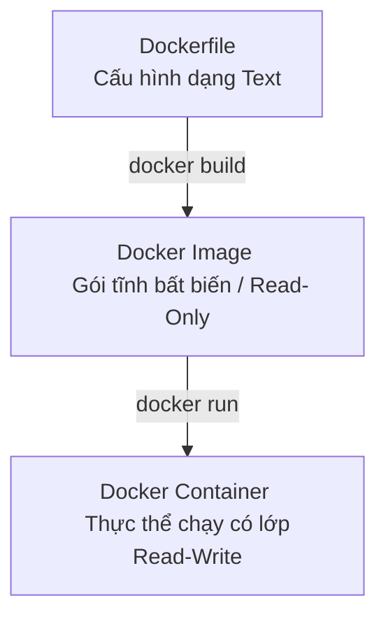

# 📄 Hướng Dẫn Viết Dockerfile Chuyên Nghiệp Từ A Đến Z

Tài liệu này cung cấp hướng dẫn chi tiết, toàn bộ các chỉ dẫn (instructions) cần biết, cùng các mẹo tối ưu hóa (Best Practices) để tạo ra những Dockerfile an toàn, gọn nhẹ và chuẩn Production.

---

## 🧭 1. Dockerfile là gì?

**Dockerfile** là một tệp văn bản không có phần mở rộng (extension) chứa một chuỗi các câu lệnh tuần tự. Docker sẽ đọc tệp này để tự động xây dựng (**build**) nên một **Docker Image**.



---

## 🛠️ 2. Bảng Tra Cứu Chỉ Dẫn Dockerfile (Instruction Cheat Sheet)

Dưới đây là toàn bộ các chỉ dẫn thông dụng nhất trong Dockerfile, xếp theo thứ tự sử dụng phổ biến:

| Chỉ dẫn | Chức năng | Ví dụ thực tế | Lời khuyên chuyên nghiệp |
| :--- | :--- | :--- | :--- |
| **`FROM`** | Khai báo Base Image xuất phát. | `FROM node:20-alpine` | Luôn chọn các image tag cụ thể và gọn nhẹ (như `-alpine` hoặc `-slim`). Tránh dùng `latest`. |
| **`WORKDIR`** | Thiết lập thư mục làm việc mặc định bên trong container. | `WORKDIR /app` | Nên khai báo rõ ràng. Nếu thư mục chưa tồn tại, Docker sẽ tự động tạo mới. |
| **`COPY`** | Sao chép tệp/thư mục từ máy host vào container. | `COPY package*.json ./` | Ưu tiên dùng `COPY` thay vì `ADD` cho các thao tác sao chép thông thường. |
| **`ADD`** | Sao chép tệp, hỗ trợ giải nén tự động và tải file từ URL. | `ADD source.tar.gz /app/` | Chỉ dùng `ADD` khi cần tự động giải nén file `.tar` hoặc tải file từ internet. |
| **`RUN`** | Thực thi lệnh trong quá trình build (tạo layer mới). | `RUN npm install && npm cache clean --force` | Kết hợp nhiều lệnh bằng `&&` và dọn dẹp cache trong cùng một dòng để giảm dung lượng Image. |
| **`ENV`** | Định nghĩa biến môi trường sử dụng cả khi build và khi chạy. | `ENV PORT=3000` | Biến này sẽ tồn tại mãi trong container khi chạy thực tế. |
| **`ARG`** | Định nghĩa biến chỉ tồn tại trong quá trình build (Build-time). | `ARG API_URL` | Không lưu thông tin mật (như password) vào đây vì nó có thể bị xem lại qua `docker history`. |
| **`EXPOSE`** | Khai báo cổng mạng container sẽ lắng nghe khi chạy. | `EXPOSE 3000` | Lệnh này chỉ mang tính chất tài liệu hóa (documentation), không tự động mở port ra ngoài máy host. |
| **`CMD`** | Lệnh mặc định chạy khi container khởi động. | `CMD ["node", "server.js"]` | Dễ bị ghi đè nếu người dùng truyền lệnh khác lúc chạy `docker run`. |
| **`ENTRYPOINT`**| Cấu hình container chạy như một file thực thi (Executable). | `ENTRYPOINT ["npm", "start"]` | Khó bị ghi đè hơn `CMD`. Thường kết hợp với `CMD` để truyền tham số mặc định. |
| **`USER`** | Đổi user thực thi các lệnh phía sau. | `USER node` | Luôn chuyển sang một user phi root (như `node`, `appuser`) trước khi chạy ứng dụng để bảo mật. |
| **`VOLUME`** | Tạo điểm gắn ổ đĩa ảo để lưu trữ dữ liệu bền vững. | `VOLUME ["/app/data"]` | Giúp tách biệt dữ liệu cần lưu trữ ra khỏi vòng đời tạm thời của container. |
| **`HEALTHCHECK`**| Kiểm tra tình trạng sức khỏe của ứng dụng trong container. | `HEALTHCHECK --interval=30s CMD curl -f http://localhost:3000/ || exit 1` | Rất quan trọng khi chạy trên Kubernetes hoặc Docker Swarm để tự động khởi động lại container bị treo. |

---

## 🔍 3. Đi Sâu Vào Các Khái Niệm Quan Trọng

### 3.1. Phân biệt `COPY` và `ADD`
*   **`COPY`**: Đơn thuần là sao chép tệp cục bộ từ máy của bạn vào container. Rất an toàn và rõ ràng.
*   **`ADD`**: Có thêm các tính năng nâng cao:
    1.  Tải tệp từ một URL từ xa.
    2.  Tự động giải nén các tệp nén (như `.tar`, `.tgz`, `.gzip`, `.zip`) vào thư mục đích.
> [!IMPORTANT]
> **Best Practice:** Theo tài liệu chính thức của Docker, hãy luôn ưu tiên sử dụng `COPY`. Chỉ sử dụng `ADD` khi bạn thực sự cần tự động giải nén một tệp nén cục bộ vào Image.

---

### 3.2. Phân biệt `CMD` và `ENTRYPOINT`
Cả hai đều dùng để khai báo lệnh chạy khi container khởi động, nhưng có cơ chế hoạt động khác nhau:

*   **`CMD`**: Cung cấp lệnh mặc định. Nếu bạn chạy `docker run <image> python app.py`, lệnh `python app.py` sẽ ghi đè hoàn toàn lệnh `CMD` trong Dockerfile.
*   **`ENTRYPOINT`**: Thiết lập một lệnh cố định không thể ghi đè trực tiếp. Nếu bạn chạy `docker run <image> app.py`, thì `app.py` sẽ được truyền vào làm **tham số** cho lệnh trong `ENTRYPOINT`.

**💡 Cách kết hợp đỉnh cao:**
```dockerfile
# Sử dụng ENTRYPOINT làm lệnh chính cố định
ENTRYPOINT ["node"]
# Sử dụng CMD làm tham số mặc định (có thể bị ghi đè)
CMD ["dist/index.js"]
```
*   Nếu chạy mặc định: Container sẽ thực thi `node dist/index.js`.
*   Nếu chạy: `docker run my-image dist/other.js`, container sẽ thực thi `node dist/other.js` (ghi đè tham số của CMD).

---

### 3.3. Phân biệt `ARG` và `ENV`
*   **`ARG` (Build-time variable):** Chỉ tồn tại khi bạn đang build image. Sau khi image build xong, biến này biến mất. Bạn truyền giá trị thông qua: `--build-arg VERSION=1.0.0`.
*   **`ENV` (Runtime environment variable):** Tồn tại cả khi build lẫn khi container đang chạy thực tế. Bạn có thể thay đổi biến này lúc khởi chạy container bằng cách dùng cờ `-e PORT=8080`.

---

## ⚡ 4. Dockerfile Chuẩn Production (Node.js Multi-stage)

Dưới đây là một Dockerfile mẫu được tối ưu hóa tối đa cho các dự án Node.js/TypeScript sử dụng kỹ thuật **Multi-stage Build**, **Bảo mật phi Root**, và **Dependency Caching**.

```dockerfile
# ==========================================
# GIAI ĐOẠN 1: BUILDER (Môi trường cài đặt & Biên dịch)
# ==========================================
FROM node:20-alpine AS builder

# Thiết lập thư mục làm việc
WORKDIR /usr/src/app

# Tận dụng Docker Cache cho dependencies
COPY package*.json ./

# Cài đặt toàn bộ dependencies (bao gồm cả devDependencies để build code TS)
RUN npm ci

# Copy toàn bộ mã nguồn dự án
COPY . .

# Biên dịch code TypeScript sang JavaScript thành phẩm (tạo ra thư mục dist/)
RUN npm run build

# Dọn dẹp devDependencies, chỉ giữ lại Production Dependencies
RUN npm prune --production


# ==========================================
# GIAI ĐOẠN 2: RUNNER (Môi trường chạy siêu gọn nhẹ)
# ==========================================
FROM node:20-alpine AS runner

# Đặt biến môi trường mặc định là production
ENV NODE_ENV=production
ENV PORT=3000

WORKDIR /usr/src/app

# Chỉ copy những file thực sự cần thiết từ giai đoạn Builder sang
COPY --from=builder /usr/src/app/package*.json ./
COPY --from=builder /usr/src/app/node_modules ./node_modules
COPY --from=builder /usr/src/app/dist ./dist

# Bảo mật: Chuyển quyền chạy sang user 'node' có sẵn trong image alpine
# Tránh chạy với quyền root để ngăn chặn lỗ hổng container breakout
USER node

# Khai báo cổng lắng nghe (cho mục đích tài liệu hóa)
EXPOSE 3000

# Kiểm tra sức khỏe định kỳ cho ứng dụng
HEALTHCHECK --interval=30s --timeout=3s --start-period=5s --retries=3 \
  CMD node -e "require('http').get('http://localhost:' + (process.env.PORT || 3000) + '/health', (res) => { if (res.statusCode === 200) process.exit(0); else process.exit(1); })" || exit 1

# Lệnh khởi chạy ứng dụng
CMD ["node", "dist/index.js"]
```

---

## 🎯 5. Các Nguyên Tắc Vàng Để Dockerfile "Xịn" Hơn

### 1. Luôn tạo file `.dockerignore`
Trước khi gửi các tệp lên Docker Daemon để build, Docker sẽ copy toàn bộ thư mục của bạn. Nếu không có `.dockerignore`, các thư mục nặng như `node_modules`, `.git`, `.env` sẽ bị bê vào gây chậm tiến trình build và lộ dữ liệu mật.
> Tạo một file `.dockerignore` cùng cấp với Dockerfile và thêm nội dung sau:
> ```
> node_modules
> npm-debug.log
> dist
> build
> .git
> .env
> .env.*
> README.md
> Dockerfile
> compose.yaml
> ```

### 2. Sắp xếp thứ tự các câu lệnh khoa học (Docker Layer Caching)
Docker build theo cơ chế các lớp (Layers) chồng lên nhau. Nếu một Layer phía trước thay đổi, toàn bộ các Layer phía sau sẽ bị mất cache và phải chạy lại từ đầu.
*   **Sai:** Đặt `COPY . .` trước `RUN npm install`. (Sửa 1 dòng code $\rightarrow$ cài lại node_modules từ đầu).
*   **Đúng:** Copy `package.json` $\rightarrow$ `RUN npm install` $\rightarrow$ Copy code còn lại $\rightarrow$ Build.

### 3. Giảm số lượng Layer bằng cách gộp lệnh
Mỗi lệnh `RUN`, `COPY`, `ADD` sẽ tạo ra một Layer mới làm tăng dung lượng Image.
*   **Không nên:**
    ```dockerfile
    RUN apt-get update
    RUN apt-get install -y curl
    RUN rm -rf /var/lib/apt/lists/*
    ```
*   **Nên dùng:**
    ```dockerfile
    RUN apt-get update && apt-get install -y curl \
        && rm -rf /var/lib/apt/lists/*
    ```

### 4. Sử dụng Alpine hoặc Distroless làm Base Image
*   Image mặc định như `node:20` nặng khoảng **1GB** vì chứa cả hệ điều hành Debian đầy đủ công cụ.
*   Image `node:20-alpine` chỉ nặng khoảng **120MB** vì chạy trên Alpine Linux tinh giản.
*   Giúp giảm thời gian kéo/đẩy Image và hạn chế tối đa các lỗ hổng bảo mật (vulnerabilities) do các gói phần mềm thừa gây ra.

---

## 💻 6. Các Lệnh Docker CLI Cần Biết Để Làm Việc Với Dockerfile

### 1. Build Image từ Dockerfile
```bash
# Build image và gắn tag (tên) là my-api:1.0.0 từ thư mục hiện tại (.)
docker build -t my-api:1.0.0 .

# Build không sử dụng bộ nhớ đệm (bắt buộc chạy lại toàn bộ lệnh)
docker build --no-cache -t my-api:1.0.0 .

# Truyền biến ARG vào quá trình build
docker build --build-arg API_URL=https://api.example.com -t my-api:1.0.0 .

# Chỉ định rõ tệp cấu hình khác nếu không đặt tên là Dockerfile
docker build -f Dockerfile.dev -t my-api:dev .
```

### 2. Xem lịch sử xây dựng và dung lượng các Layer
Lệnh này cực kỳ hữu ích để bạn kiểm tra xem layer nào đang chiếm dung lượng lớn nhất nhằm tối ưu hóa lại Dockerfile.
```bash
docker history my-api:1.0.0
```

---

> [!TIP]
> Hãy tập thói quen chạy thử `docker init` trước để tham khảo cấu hình chuẩn mà Docker đề xuất cho công nghệ bạn đang dùng, từ đó tinh chỉnh thêm để đạt hiệu quả cao nhất.
